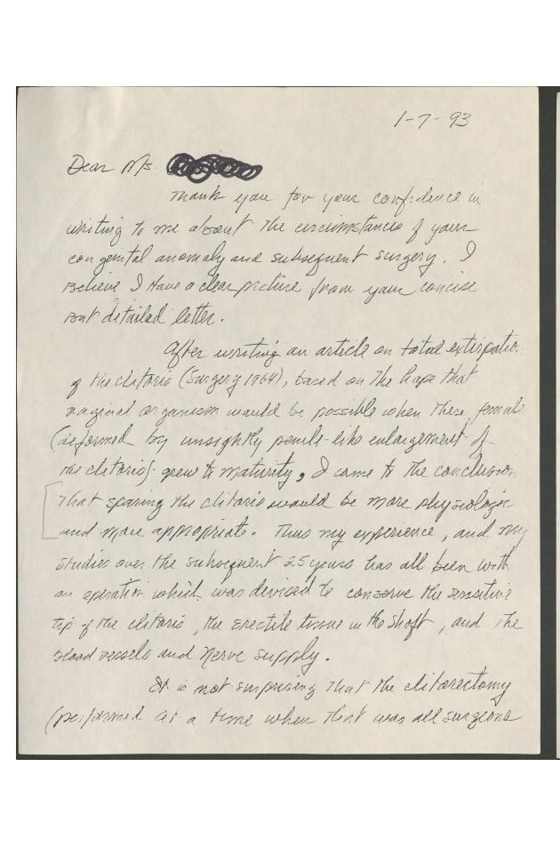
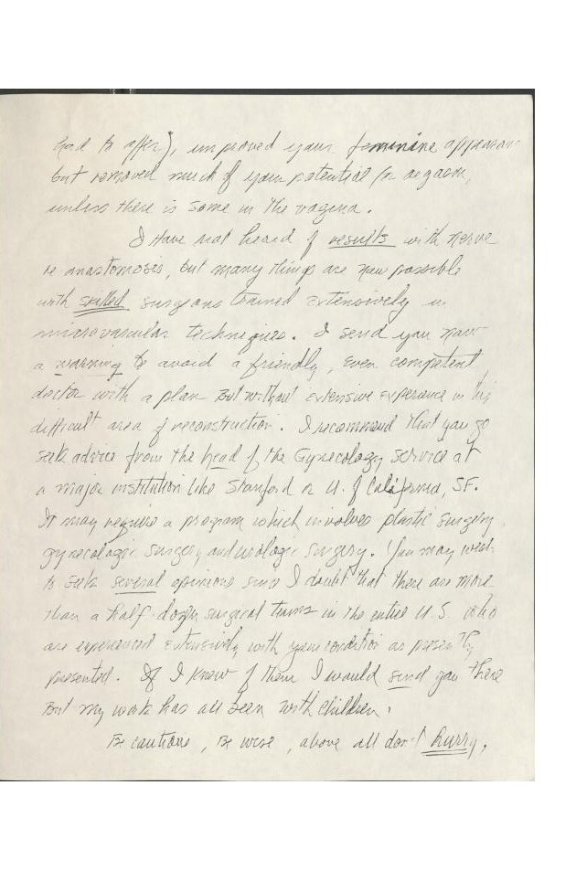
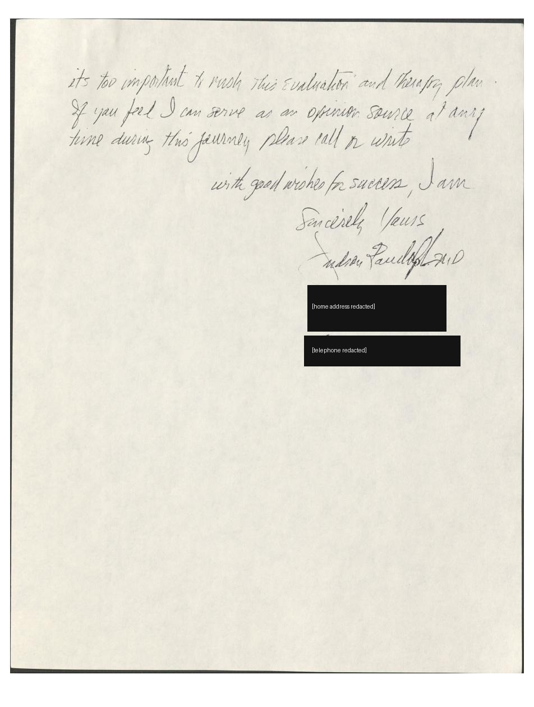
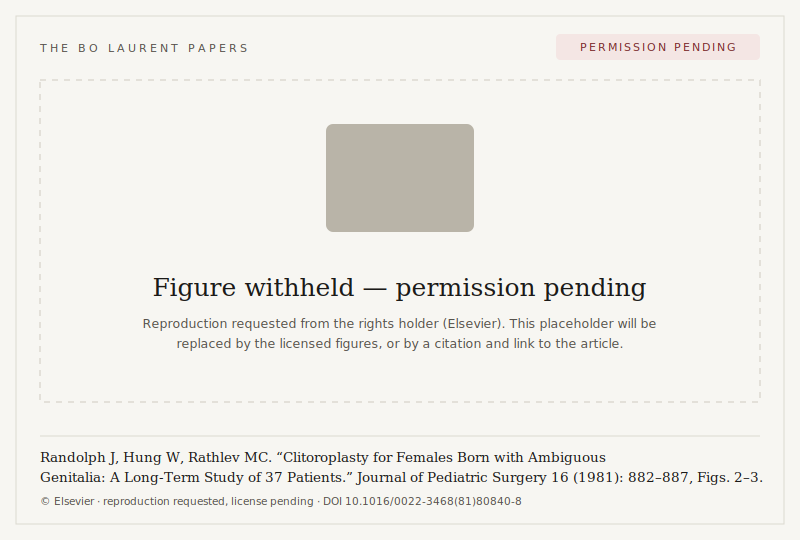

*Editorial package for the Bo Laurent Papers.*

## Headnote

These four letters, exchanged over about four months in 1992–1993, document a hinge moment — both personal and historical. The first letter is faxed from Kamakura, Japan, in September 1992; by the December follow-up the writer has relocated to San Francisco "to work on healing myself"; Judson Randolph replies by hand in January 1993; and the final letter, dated 31 January 1993, turns from the search for a surgical "repair" toward a wholly different idea — a support group of women who had undergone the same surgery. That reframing, from an individual medical problem to a collective one, is the founding logic of the intersex movement, and it appears here in real time, on the page, months before the Intersex Society of North America was established later that same year.

The letters are signed "Bonnie Sullivan," the writer's legal name until 1995, when it was changed to Bo Laurent. They are addressed to Judson G. Randolph (1927–2015), for nearly thirty years Surgeon-in-Chief at Children's National Medical Center in Washington, D.C., and co-author of "Clitorectomy for Sexual Abnormalities: Indications and Technique" (*Surgery*, 1966) and of the earlier 1964 paper on total clitoral extirpation to which he refers in his reply.

Read together, the four documents trace an arc: a survivor approaches the surgeon-author of the technique used on people like her, not as an adversary but as a self-taught peer armed with his own literature; she asks the question underneath the whole inquiry — whether the profession ever actually knew the sexual outcomes of what it did; the surgeon answers with unusual candor, describing his own change of practice and conceding that the operation "improved your feminine appearance but removed much of your potential for orgasm"; and the correspondence closes not in resignation but in the decision to find, and speak with, others.

---

## Note on this edition

**Transcription.** Transcriptions follow the originals as closely as possible. Original spelling and usage are preserved; obvious slips of the pen are marked **[sic]** at first occurrence and are *not* silently corrected, because in Randolph's handwritten reply the slips are part of the texture of a candid letter written quickly by hand. Line breaks in the source address blocks are retained; paragraph breaks in the letter bodies follow the originals.

**Facsimiles.** Each transcription is intended to sit beside a scanned image of the source (see the accompanying PDF). Where a document is available only as the writer's own later transcription (Randolph's handwritten reply), this is noted.

**Redactions.** The following are masked: the third-party name on the September fax cover line; Dr. Randolph's home street address and telephone number wherever they appear — in the transcriptions, the metadata, **and on the scanned image of the final handwritten page**; and the writer's own historical street addresses, postal codes, telephone/fax numbers, and the local part of the writer's email address. For the writer's own details the **city and state/country are retained** (Kamakura, Japan; San Francisco, CA), the **email domain is retained**, and only the finer-grained locators are removed.

**Rights.** The three letters written by Bonnie Sullivan are the author's own and may be published at will. Randolph's reply raises a separate question and is flagged accordingly (see *Rights & permissions*, below). It is transcribed here for editorial use; the decision on public reproduction is held open.

::: {.column-margin .letter-timeline}
::: {.lt-entry}
[24 September 1992]{.lt-date} · [Sullivan → Randolph]{.lt-dir}

[Faxed from Kamakura — a survivor writes to the surgeon-author of the technique used on her.](#letter-1){.lt-gloss}
:::
::: {.lt-entry}
[5 December 1992]{.lt-date} · [Sullivan → Randolph]{.lt-dir}

[Now in San Francisco, she presses the question underneath it all.](#letter-2){.lt-gloss}
:::
::: {.lt-entry .lt-entry--reply}
[7 January 1993]{.lt-date} · [Randolph → Sullivan]{.lt-dir}

[He replies by hand, with unusual candor about what the operation removed.](#letter-3){.lt-gloss}
:::
::: {.lt-entry}
[31 January 1993]{.lt-date} · [Sullivan → Randolph]{.lt-dir}

[The turn: from a surgical "repair" toward a support group of women who had the same surgery.](#letter-4){.lt-gloss}
:::
:::

---

## 1. Bonnie Sullivan to Judson Randolph, 24 September 1992 {#letter-1}

**Metadata**

- **Date:** 24 September 1992
- **Sender:** Bonnie Sullivan, Kamakura, Japan
- **Recipient:** Dr. Judson Randolph, Department of Surgery, Children's National Medical Center, Washington, D.C.
- **Medium:** Typed letter, transmitted by fax
- **Extent:** 1 letter (2 pp. as scanned)
- **Signature:** "Yours Truly" (typed); signed *Bonnie Sullivan*
- **Provenance:** Author's retained copy
- **Related:** Followed up by the letter of 5 December 1992 (item 2) after no reply
- **Redaction flags:** third-party name on the fax cover line — **masked**. Sender's own Kamakura street address, postal code, telephone, and fax — **masked**; email local part **masked**, domain retained (city and country retained).
- **Rights:** Author's own; publishable in full

**Transcription**

> 24 September 1992
>
> Dr. Judson Randolph
> Department of Surgery
> Children's National Medical Center
> 111 Michigan Ave NW
> Washington DC 20010 USA
> Tel: 202-745-5000
> Fax: 202-939-4492
>
> Bonnie Sullivan
> [street address redacted]
> Kamakura, Japan
> [telephone redacted]
> [fax redacted]
> Internet email: [redacted]\@mit.edu
>
> Dear Dr. Randolph,
>
> Your name is familiar to me from your papers on clitoral reconstruction and older ones on clitorectomy. I am writing to ask you for some information about clitorectomy, which is of very personal interest to me, as I will describe below. In exchange, I can offer to share any aspects of my personal experience that may be of interest.
>
> I was born in 1956 with an enlarged clitoris and bilateral ovo-testes. Everything else was female normal, I chromatin test positive, and my karyotype is 46,XX. However, I was raised as a boy until age 18 months, at which time I was diagnosed as a true hermaphrodite, my clitoris was removed as far as the division of the corpora, and my parents were told to rename me and raise me as a girl. At age 8, the testicular part of my gonads was removed, and sufficient ovarian tissue remained to allow me to experience natural feminizing puberty without exogenous hormones. My emotional development was considerably more hazardous. I discovered these facts at age 22, after no small battle with hospital bureaucracy and with obstructive physicians. By the way, I was not seen or operated on by you or your colleagues.
>
> I am now 36 years old, and my sex life has always been quite miserable. Sex therapy has not been helpful. In trying to understand what was done to me, and why, I have obtained most of my medical records, and have done a fairly extensive review of the historical literature. According to my reading of the surgeon's notes, the crura should be intact. ("External genitalia were then exposed and incision was made around the base of the clitoris. This was dissected free from the surrounding tissue as far back as the division of the corpora where it was clamped, divided and stump ligated"). The pre-surgery photo is missing, but the pathology report states that the tissue removed was 3 cm long. I interpret this as a clitoris which protrudes about 1 cm (Does that sound correct?)
>
> I am aware that some women have reported orgasm in spite of having been clitorectomized. I am also aware that many such women report erotic sensation in the stump. In my case there is no clitoral sensation whatsoever, and I am inclined to think that these women experienced clitoral amputation, rather than a deep removal. I am also aware of reports that a minority of Sudanese women who have been subjected to the Pharaonic circumcision (clitoral excision followed by labial infibulation) may be orgasmic. Although the damage to their genitals is certainly extreme, it strikes me that traditional practitioners lack the surgical technique to remove the clitoris as deeply as was done in my case.
>
> You were a co-author of the article "Clitorectomy for sexual abnormalities: Indications and Technique" (Surgery, Feb 1966). I am also aware of your report in the Journal of Pediatric surgery earlier this year on long term follow-up of women after clitoral reconstruction, without removal of clitoral tissue.
>
> I would like to know what knowledge you have of the sexual response of the women who were subjected to the deep removal described in 1966. Since they have had even more tissue removed than I have, a believable report of sexual adequacy, including orgasm, in them would be of some encouragement to me.
>
> I have been in contact with a plastic surgeon, a specialist in transexual surgery, who tells me that he has performed clitorectomy repairs. He states that he has been able to achieve a positive effect on sexual satisfaction for more than one woman with this surgery. In a modification of the female to male surgery, he takes a flap of skin from the forearm and uses it to construct a clitoris, connecting the nerves to the severed pudendal nerve. Have you heard of this kind of thing? Do you have any opinion about the likelihood that it could work?
>
> Yours Truly,
>
> Bonnie Sullivan

**Editorial note.** The letter's method is worth flagging for readers: the writer quotes her own operative note and pathology report, cites Randolph's 1966 *Surgery* article by title and his recent *Journal of Pediatric Surgery* follow-up, and distinguishes "amputation" from "deep removal" — building a clinical case, in the profession's own vocabulary, toward a single question: whether anyone with removal as extensive as hers retained sexual response.

---

## 2. Bonnie Sullivan to Judson Randolph, 5 December 1992 {#letter-2}

**Metadata**

- **Date:** 5 December 1992
- **Sender:** Bonnie Sullivan, San Francisco, CA [street address redacted]
- **Recipient:** Dr. Judson Randolph, Children's National Medical Center, Washington, D.C.
- **Medium:** Typed letter
- **Extent:** 1 letter (1 p.)
- **Signature:** "Yours Truly" (typed); signed *Bonnie Sullivan*
- **Provenance:** Author's retained copy
- **Related:** Encloses a copy of the 24 September 1992 letter (item 1); prompts Randolph's reply of 7 January 1993 (item 3)
- **Redaction flags:** sender's San Francisco street address, postal code, and telephone/fax — **masked** (city and state retained)
- **Rights:** Author's own; publishable in full

**Transcription**

> 5 December 1992
>
> Dr. Judson Randolph
> Department of Surgery
> Children's National Medical Center
> 111 Michigan Ave NW
> Washington DC 20010 USA
> Tel: 202-745-5000
> Fax: 202-939-4492
>
> Bonnie Sullivan
> [street address redacted]
> San Francisco, CA
> [telephone / fax redacted]
>
> Dear Dr. Randolph,
>
> I am enclosing a copy of a letter which I transmitted to your office by fax in September. As I have received no response, I wonder if the letter did not find its way to you (I understand that you have retired).
>
> I have now relocated to the United States in order to work on healing myself. I am working with a very helpful psychotherapist, but I want the information which you must possess about the outcome of clitoral extirpation. I would very much like to hear from you. You can reach me by mail or collect telephone at the above location. Note that I will be out of town from 15 December until 31 December.
>
> Yours Truly,
>
> Bonnie Sullivan

---

## 3. Judson Randolph to Bonnie Sullivan, 7 January 1993 {#letter-3}

**Metadata**

- **Date:** 7 January 1993 (dated "1-7-93")
- **Sender:** Judson Randolph, M.D., Nashville, Tennessee [home street address redacted]
- **Recipient:** Ms. Bonnie Sullivan
- **Medium:** Autograph letter, signed (handwritten)
- **Extent:** 1 letter (2 pp. as scanned)
- **Signature:** "Sincerely Yours, Judson Randolph, M.D." (autograph)
- **Provenance:** The transcription below follows Bo Laurent's own contemporaneous transcription of the letter as received. The reproduced scans are of the copy preserved in the **Suzanne Kessler Papers** (call no. ams.0219), Box 1, folder "Correspondence — 'Chase,' 1992–1993," **Joseph A. Labadie Collection, Special Collections Research Center, University of Michigan Library**. That folder was digitized by the Library in May 2025 at the request of Yarden Azoulay Katz, who provided the scan to Bo Laurent on 19 May 2025.
- **Related:** Replies to items 1–2; answered by item 4
- **Redaction flags:** Randolph's home street address and telephone number — **masked in this version** (city and state retained, as these appear in his published obituaries)
- **Rights:** Author is Judson Randolph; copyright rests with his estate/heirs. **Reproduced in full under a fair-use rationale** (see *Rights & permissions*). The handwritten pages are reproduced as scanned images; the printed home address and telephone number on the final page have been redacted.

**Scanned images**

{#fig-randolph-p1 fig-alt="Handwritten manuscript page in cursive, dated 1-7-93, beginning 'Dear Ms Sullivan'."}

{#fig-randolph-p2 fig-alt="Handwritten manuscript page in cursive continuing the letter."}

{#fig-randolph-p3 fig-alt="A handwritten manuscript page ending in a signature, with two black redaction boxes over a printed address label and a phone number."}

**Transcription** *(from the recipient's transcription of the handwritten original; [sic] marks the original's spelling)*

> 1-7-93
>
> Dear Ms Sullivan,
>
> Thank you for your confidence in [w]riting to me about the circumstances of your congenital anomaly and subsequent surgery. I believe I have a clear picture from your concise but detailed letter.
>
> After writing an article on total extirpation of the clitoris (Surgery 1964), based on the hope that vaginal organism [sic] would be possible when these females, (deformed by unsightly penile-like enlargment [sic] of the clitoris) grew to maturity, I came to the conclusion that sparing the clitoris would be more physiologic [sic] and more appropriate. Thus my experience, and my studies over the subsequent 25 years has all been with an operation which was devised to conserve the sensitive tip of the clitoris, the erectile tissue in the shaft, and the blood vessels and nerve supply.
>
> It is not surprising that the clitorectomy (performed at a time when that was all surgeons had to offer), improved your feminine appearance [sic] but removed much of your potential for orgasm, unless there is some in the vagina.
>
> I have not heard of results with nerve re-anastomosis, but many things are now possible wiht [sic] skilled surgeons trained extensively in microvascular techniques. I send you now a warning to avoid a friendly, even competent doctor with a plan but without extensive experience in this difficult area of reconstruction. I recommend that you go seek advice form [sic] the head of the Gynecology service at a major institution like Stanford or U. of California, SF. It may require a program which involves plastic surgery, gynecologic surgery, and urologic surgery. You may wish to seek several opinions since I doubt that there are more than a half dozen surgical teams in the entire U.S. who are experienced extensively with your condition as presently presented. If I knew of them I would send you there. But my work has all been with children.
>
> Be cautious, be wise, above all don't hurry, its [sic] too important to rush this evaluation and therapy plan. If you feel I can serve as an opinion source at any time during this journey please call or write.
>
> with good wishes for success, I am
>
> Sincerely Yours
> Judson Randolph, M.D.
>
> [home address redacted]
> Nashville, Tennessee
> [telephone redacted]

**Editorial note.** This is the pivotal document in the set. Its evidentiary weight comes from its source: the surgeon-author of the technique, writing privately and in his own hand, describing his own change of practice — from the 1964 total-extirpation paper, premised on the hope that "vaginal orgasm would be possible," to a later conviction that "sparing the clitoris would be more physiologic" — and stating plainly that the earlier operation "improved your feminine appearance but removed much of your potential for orgasm."

Randolph dates the extirpation paper to "Surgery 1964"; writing nearly thirty years later, he appears to be misremembering the year. No 1964 *Surgery* paper by these authors on the subject has been located; the article he describes is almost certainly Gross, Randolph & Crigler, "Clitorectomy for Sexual Abnormalities: Indications and Technique," *Surgery* 59 (1966): 300–308 — the same paper the writer cites, correctly, in her opening letter (item 1). It is worth noting for readers that this article, and Randolph's later clitoroplasty papers, describe patients in the surgeons' own words as "deformed," "unsightly," "embarrassing," and "offensive"; his candor in this private letter stands against that published vocabulary. The contrast runs deeper than tone: in this letter Randolph names the loss of sexual function directly, whereas his published record has no place for it — his 1981 long-term study enters a patient's refusal of further surgery only as a "disfiguring" cosmetic failure, her own reasons unasked. That article is taken up in the editor's note below.

The technique was published as a plate of operative photographs. It appears here as Figure 1, redacted, with the surgeons' own caption left intact:

<figure class="redact">
  <svg class="redact__plate" viewBox="0 0 600 720" role="img" aria-labelledby="redact-t redact-d" xmlns="http://www.w3.org/2000/svg">
    <title id="redact-t">Figure 1. Redacted operative plate.</title>
    <desc id="redact-d">A two-by-two plate representing four operative photographs from Gross, Randolph and Crigler (1966). Each photograph is covered by a solid redaction panel labelled A through D. A centimetre scale bar is reproduced beneath panel D.</desc>
    <rect width="600" height="720" fill="#f7f6f2"/>
    <!-- redaction panels -->
    <rect x="0"   y="0"   width="297" height="357" fill="#1b1a18"/>
    <rect x="303" y="0"   width="297" height="357" fill="#1b1a18"/>
    <rect x="0"   y="363" width="297" height="357" fill="#1b1a18"/>
    <rect x="303" y="363" width="297" height="357" fill="#1b1a18"/>
    <!-- panel labels (light on the redaction, as in the source) -->
    <g fill="#f7f6f2" font-family="'IBM Plex Mono', ui-monospace, monospace" font-size="28" font-weight="700">
      <text x="16"  y="44">A</text>
      <text x="319" y="44">B</text>
      <text x="16"  y="407">C</text>
      <text x="319" y="407">D</text>
    </g>
    <!-- scale bar beneath panel D: a fact, recreated, not their expression -->
    <rect x="303" y="676" width="297" height="44" fill="#f7f6f2"/>
    <g stroke="#1b1a18" stroke-width="1">
      <line x1="322" y1="688" x2="584" y2="688"/>
      <!-- major ticks -->
      <line x1="322" y1="682" x2="322" y2="694" stroke-width="1.4"/>
      <line x1="374" y1="682" x2="374" y2="694" stroke-width="1.4"/>
      <line x1="427" y1="682" x2="427" y2="694" stroke-width="1.4"/>
      <line x1="479" y1="682" x2="479" y2="694" stroke-width="1.4"/>
      <line x1="532" y1="682" x2="532" y2="694" stroke-width="1.4"/>
      <line x1="584" y1="682" x2="584" y2="694" stroke-width="1.4"/>
      <!-- minor ticks -->
      <line x1="348" y1="685" x2="348" y2="691"/>
      <line x1="400" y1="685" x2="400" y2="691"/>
      <line x1="453" y1="685" x2="453" y2="691"/>
      <line x1="505" y1="685" x2="505" y2="691"/>
      <line x1="558" y1="685" x2="558" y2="691"/>
    </g>
    <g fill="#1b1a18" font-family="'IBM Plex Mono', ui-monospace, monospace" font-size="13" text-anchor="middle">
      <text x="322" y="708">4</text>
      <text x="374" y="708">5</text>
      <text x="427" y="708">6</text>
      <text x="479" y="708">7</text>
      <text x="532" y="708">8</text>
      <text x="584" y="708">9</text>
    </g>
    <text x="453" y="718" fill="#1b1a18" font-family="'IBM Plex Mono', ui-monospace, monospace" font-size="11" text-anchor="middle" letter-spacing="1">cms.</text>
  </svg>

  <figcaption class="redact__cap">
    Figure 1
    "Fig. 7. D: Specimen clearly demonstrates the large amount of clitoral tissue which lies beneath the skin and must be removed."
    Gross, Randolph &amp; Crigler, &ldquo;Clitorectomy for sexual abnormalities: indications and technique,&rdquo; Surgery 59 (1966), Fig.&nbsp;7, p.306.
    The original reproduces four operative photographs during clitorectomy, redacted here by the editor. They are disturbing; consult R1 to view the source.
  </figcaption>
</figure>

---

## 4. Bonnie Sullivan to Judson Randolph, 31 January 1993 {#letter-4}

**Metadata**

- **Date:** 31 January 1993
- **Sender:** Bonnie Sullivan, San Francisco, CA [street address redacted]
- **Recipient:** Dr. Judson Randolph, Nashville, Tennessee [home street address redacted]
- **Medium:** Typed letter
- **Extent:** 1 letter (1 p.)
- **Signature:** "Yours Truly" (typed); signed *Bonnie Sullivan*
- **Provenance:** Author's retained copy
- **Related:** Replies to Randolph's letter of 7 January 1993 (item 3)
- **Redaction flags:** recipient's (Randolph's) home street address — **masked**. Sender's own San Francisco street address, postal code, and telephone — **masked** (city and state retained).
- **Rights:** Author's own; publishable in full

**Transcription**

> 31 January 1993
>
> Dr. Judson Randolph
> [home address redacted]
> Nashville Tennessee
>
> Bonnie Sullivan
> [street address redacted]
> San Francisco, CA
> [telephone redacted]
>
> Dear Dr. Randolph,
>
> Thank you very much for your kind letter. I have now had the chance to speak with several surgeons about the possibility of microsurgical repair. Two in particular seemed to be well qualified to educate me about what is possible. One of these surgeons is associated with a clinic that is a leading center in microsurgical reconstruction (although not genital surgery). The other has extensive experience with phallic reconstruction for trauma and for female to male transexual patients.
>
> It seems that no one has done a clitoral reconstruction. It is theoretically possible to harvest some tissue from between toes or fingers, dissect my genitals, locate the severed pudendal nerve, attach the nerve from the harvested tissue to the pudendal nerve, open the abdomen to get an artery to deliver enough blood to allow adequate healing, and perhaps produce a neo-clitoris with some tactile, erotic sensitivity, but far less than an actual clitoris. My judgment is that there is some possibility of success, but not enough to justify the risk, the extensive surgery, the expense, the genital dissection (with possible damage to some of the sensation I do have now or even to urinary continence), and the ugly secondary defect. I have therefore abandoned the idea of surgery.
>
> I am writing now to ask you a favor. My sexual anatomy, following clitorectomy, is very different from that of every other woman I know. There is no one who can really understand what my sexual experience is like, no one whose body works like mine and with whom I can talk about how to best use the sexual resources that remain to us. I have come to the conclusion that it would be very healing to form a support group. I know that there are other women in the same situation as me. It would be healing for me, and I think for them as well, to be able to share our experiences.
>
> I am writing you now, therefore, to ask you to help me to meet some of your ex-patients. I realize that you cannot give me their names. I give you permission to give my name, address, and telephone number, as well as this letter, to any of your former patients, and to invite them to contact me. I do hope that you will be able to help me in this way.
>
> Yours Truly,
>
> Bonnie Sullivan
>
> PS: Please note my new address. I have now settled into my own apartment in San Francisco.

**Editorial note.** The historically decisive turn. Having investigated microsurgical reconstruction and rejected it on a clear cost–benefit basis, the writer reframes the problem from a medical one to a collective one — proposing a support group of women with the same history, and offering her own name and letter as the point of contact. This is the founding impulse of the intersex-rights movement, recorded months before the Intersex Society of North America was established later in 1993.

---

## Editor's note: the 1981 article

The two surgical figures associated with this item come from Randolph's long-term study of thirty-seven clitoroplasty patients, published in the *Journal of Pediatric Surgery* in 1981 (reference R3). The article is worth reading against the correspondence, for what it does not say.

{#fig-randolph-1981 fig-alt="Placeholder card stating that the surgical figures are withheld pending permission from the rights holder."}

Randolph reports that three of his patients had, in his term, an "unsatisfactory outcome": their clitorises remained enlarged after surgery. One went on to clitorectomy; one was to be operated on again later; and one, he writes, "adamantly refused further surgery," despite what he calls the "disfiguring prominence" of her clitoris.

That refusal is recorded entirely as a surgical problem. It appears as a cosmetic failure the surgeon was not allowed to correct — her clitoris is "disfiguring," and the regret in the sentence is his own, that he could not operate again. What the article never asks is why she refused. She was old enough to decide; old enough, perhaps, to weigh what she had felt before the surgery against what she felt after, and to conclude that another operation would take more than it returned. The possibility that she had experienced the earlier surgery not as correction but as loss — as mutilation rather than disfigurement — is nowhere in the text. Randolph does not speculate — though in private, as his letter of 7 January 1993 shows, he could name exactly such a loss. The framework of the article has no column for the patient's own sensation, only for the surgeon's judgment of how she looks.

This is precisely the omission that the letters in this file press upon. Writing to Randolph a decade later, Bo Laurent put to him directly the question his article leaves out — what the surgery had done to sexual sensation and experience. The patient who "adamantly refused" is not named in the article and cannot be spoken for here; but the silence in the record about her reasons is itself part of the history this archive keeps.

---

## Finding-aid summary

| # | Date | From → To | Place of origin | Medium | Rights |
|---|------|-----------|-----------------|--------|--------|
| 1 | 24 Sep 1992 | Sullivan → Randolph | Kamakura, Japan | Typed (faxed) | Author's own |
| 2 | 5 Dec 1992 | Sullivan → Randolph | San Francisco, CA | Typed | Author's own |
| 3 | 7 Jan 1993 | Randolph → Sullivan | Nashville, TN | Autograph, signed | Estate — full text + scans reproduced under fair use |
| 4 | 31 Jan 1993 | Sullivan → Randolph | San Francisco, CA | Typed | Author's own |

**Associated material.** Two surgical figures (Fig. 2 and Fig. 3) accompany the file (`randolph.gif`). They depict the clitoral *recession* technique — recession of the shaft beneath the pubis with sutures placed in the pubic periosteum and Buck's fascia — associated with Randolph's clitoroplasty publications (Randolph & Hung 1970; Randolph, Hung & Rathlev 1981; see references R2–R3). These are published journal illustrations; reproduction rights rest with the publisher, not with the author of the letters or with Randolph's estate. Recommend citation/link, or a low-resolution excerpt under fair use with full citation, rather than clean reproduction.

---

## Rights & permissions

**Items 1, 2, and 4** were written by the author of the Papers and may be published without restriction.

**Item 3 (Randolph's reply)** is reproduced in full — transcription and scanned images — under a fair-use rationale. Copyright in a letter belongs to its author, not its recipient; Judson Randolph died on 17 May 2015, so that copyright rests with his estate/heirs. The decision to publish accepts a considered, low residual risk in light of the document's historical importance and the factors set out in the statement below. The one factor weighing against fair use is that the letter is unpublished; the countervailing factors — nonprofit educational purpose, documentary and critical framing, absence of any market for the work, the recipient's ownership of the physical letter, and the fact that it concerns medical procedures performed on the recipient herself — are strong. The home address and telephone number printed on the final page have been redacted from both the transcription and the scanned image, which also reduces any privacy concern for the author's surviving family. This is an editorial judgment, not legal advice.

### Fair-use statement (for publication alongside the letter)

> This letter is reproduced by the Bo Laurent Papers for nonprofit, educational, and historical purposes. It is presented as a primary source, with critical and documentary commentary, to illuminate the history of the medical treatment of intersex people and the correspondence that preceded the founding of the Intersex Society of North America. The letter was written privately to Bo Laurent (then Bonnie Sullivan), who retains the original, and it concerns surgery performed on her in childhood. It has never been published or commercially licensed, and this reproduction does not substitute for or diminish any market for the work. The author's home address and telephone number have been redacted. We believe this use constitutes fair use under 17 U.S.C. § 107. Rights holders with questions may contact the Papers.

*Recommend having counsel or the site's editorial authority confirm the statement before publication, and adapting the contact line to the Papers' preferred point of contact.*

**Content note.** Given the frank discussion of genital surgery and sexual function, a brief reader note at the head of the published set is recommended — not to soften the material, simply ordinary care for the audience.

---

## References

DOIs are given where one has been assigned. Articles predating the DOI system are cited with journal, volume, and page; a PubMed ID (PMID) is supplied where available. All identifiers below were verified against the publisher or PubMed record.

### Works referenced within the correspondence

**R1.** Gross RE, Randolph J, Crigler JF Jr. "Clitorectomy for Sexual Abnormalities: Indications and Technique." *Surgery* 59, no. 2 (February 1966): 300–308. *(No DOI assigned; pre-DOI era.)* — The clitoral-extirpation paper cited by the writer in item 1, and the article Dr. Randolph refers to (misdating it "1964") in item 3.

**R2.** Randolph JG, Hung W. "Reduction Clitoroplasty in Females with Hypertrophied Clitoris." *Journal of Pediatric Surgery* 5, no. 2 (1970): 224–231. DOI: 10.1016/0022-3468(70)90279-4. — The clitoral-recession technique depicted in the accompanying figures.

**R3.** Randolph J, Hung W, Rathlev MC. "Clitoroplasty for Females Born with Ambiguous Genitalia: A Long-Term Study of 37 Patients." *Journal of Pediatric Surgery* 16, no. 6 (December 1981): 882–887. DOI: 10.1016/0022-3468(81)80840-8. — The most likely referent for the "long term follow-up... after clitoral reconstruction" the writer names in item 1.

**R4.** Newman K, Randolph J, Anderson K. "The Surgical Management of Infants and Children with Ambiguous Genitalia: Lessons Learned from 25 Years." *Annals of Surgery* 215, no. 6 (June 1992): 644–653. DOI: 10.1097/00000658-199206000-00011. PMID: 1632686. — An alternative possible referent for the writer's "earlier this year" (1992) follow-up reference; note that it appeared in *Annals of Surgery*, not the *Journal of Pediatric Surgery* she names, so the 1981 study (R3) remains the better fit.

### Sources for the headnote and rights notes

**S1.** Chase C. "Hermaphrodites with Attitude: Mapping the Emergence of Intersex Political Activism." *GLQ: A Journal of Lesbian and Gay Studies* 4, no. 2 (1998): 189–211. DOI: 10.1215/10642684-4-2-189. — The author's own account of the founding of ISNA in 1993.

**S2.** Intersex Society of North America. "Cheryl Chase (Bo Laurent)." Archived biographical page. https://isna.org/about/chase/ (preserved by interACT: Advocates for Intersex Youth). — Confirms the 1993 founding of ISNA and the 1995 legal name change from Bonnie Sullivan to Bo Laurent.

**S3.** Barnes, Bart. "Judson Randolph, Pediatric Surgeon, Dies at 87." *The Washington Post*, 26 June 2015. — Dates of Randolph's life (1927–2015) and career.

**S4.** George Washington University School of Medicine and Health Sciences. "GW SMHS Remembers Faculty Member and Leader in Pediatric Surgery, Judson G. Randolph, M.D." 2015. https://smhs.gwu.edu/news/ — Randolph's tenure as Surgeon-in-Chief at Children's National (1963 – retirement, 1991).

*A short additional obituary appeared in the* Journal of Pediatric Surgery *50, no. 8 (2015): 1429–1430.*

*Confirm any page numbers against the originals before setting these in the house style of the Papers.*
