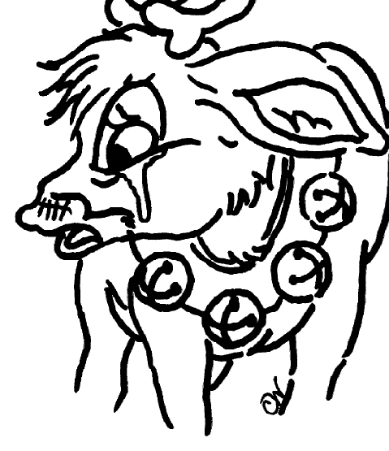
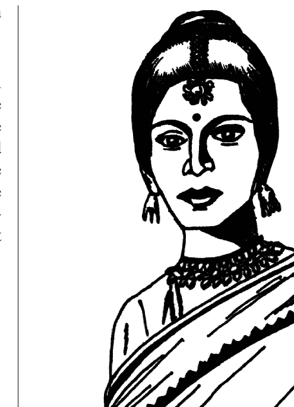
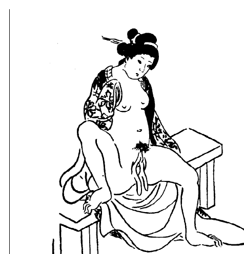

## Headnote

<!-- DRAFT in your voice — rewrite freely. Facts I can't verify are bracketed. -->

This is the first issue of *Hermaphrodites with Attitudes*, the newsletter of the
Intersex Society of North America, dated Winter 1994. It was the movement's first
regular publication: after sixteen months of answering letters one at a time, ISNA
now had a shared voice that reached, as the opening page reports, intersex people in
five countries. I edited and typeset it, and — as the bylines throughout show — it
appeared under the name I used then, Cheryl Chase.

What I wanted the issue to be is visible in its range. It moves from first-person
testimony (Kira Triea's "The Awakening," Morgan Holmes's "I'm still intersexual,"
the journal entry titled "I am not alone!") to argument (the reply to John Money in
"Whose sex errors?" and "Dr. Money and *The Five Sexes*"), to reportage (Anne Ogborn
writing from among the Hijra of New Delhi), to poetry, to satire — the mock "Case
report" by "Will B. Dunn, M.D." performs cosmetic genital surgery on Rudolph the
reindeer to expose the logic of the real thing. Putting rage, scholarship, grief, and
a joke about a reindeer's nose in the same six pages was the point: it was a newsletter
"with attitude."

::: {.callout-note collapse="true"}
## Provenance and a note on this transcription

The physical materials are held in the [Kinsey Institute Library's archival
collections](https://kinseyinstitute.org/collections/archival/index.html). This issue
is **born-digital**: it was laid out in Adobe FrameMaker and distilled
to PDF with Acrobat Distiller on 26 October 2000, so the file below is a 2000 re-master
of the 1994 document. It corresponds to catalog record `hwa-01`.

The transcription preserves original spelling, punctuation, and period terminology;
square brackets mark editorial clarifications; where the original ran an article across
to page 6, the parts are rejoined here with a note. Illustrations are described in
captions, and the full visual layout is preserved in the PDF. Reproduced under the
issue's own "Free to copy and distribute" terms (© 1994 ISNA).

*(Note: the masthead of this first issue reads "Hermaphrodites with Attitude**s**,"
plural. Later usage settled on the singular "Attitude.")*
:::

## Read the original issue

<iframe src="hwa_winter1994.pdf" width="100%" height="900" style="border:1px solid var(--bs-border-color, #ddd); border-radius:4px;" title="Hermaphrodites with Attitudes, Vol. 1 No. 1, Winter 1994 (PDF)"></iframe>

[**Download the original PDF**](hwa_winter1994.pdf) &middot; 6 pages, US letter, born-digital (Adobe FrameMaker → Acrobat Distiller, 2000), ~550 KB.

## Contents

The issue as it was laid out, in reading order. Each title links to its transcription below.

- [Welcome, readers!](#welcome) — the editor, on why "Hermaphrodites with Attitudes"
- [Case report](#case-report) — *Will B. Dunn, M.D., FACS* — a satire on cosmetic genital surgery
- [The Awakening](#the-awakening) — *Kira Triea*
- [Whose sex errors?](#whose-sex-errors) — a reply to John Money's *Sex Errors of the Body*
- [Hermaphrodites on the infobahn](#infobahn) — ISNA's new email list
- [Going home](#going-home) — *Anne Ogborn* — among the Hijra in New Delhi
- [Thirty seconds over Penn Station](#thirty-seconds) — *Kira Triea* (poem)
- [Hijras and intersexuals](#hijras-and-intersexuals) — *Anne Ogborn*
- [Winged labia: Deformity or gift?](#winged-labia) — *Cheryl Chase*
- [Morgan awarded M.A.!](#morgan-ma) — Morgan Holmes defends her thesis
- [San Francisco chapter meets!](#sf-chapter)
- [I am not alone!](#i-am-not-alone) — *from David's personal journal*
- [Dr. Money and *The Five Sexes*](#money-five-sexes) — *Cheryl Chase*
- [I'm still intersexual](#still-intersexual) — *Morgan Holmes*
- [Send Money!](#send-money) — an appeal
- [Colophon](#colophon)

## Full transcription

<!-- TRANSCRIPTION START -->

### Welcome, readers! {#welcome}

Long promised, long delayed, but here it is. ISNA now has its own newsletter. I hope that many of you will contribute short articles, stories, poetry, and illustrations so that the next issue can be even more of a collaborative effort.

Who are we? In the 16 months since ISNA was founded, we have responded to hundreds of inquiries from intersexuals, therapists, educators, parents, physicians, academics, and journalists. The Intersex Society mailing list now reaches intersexuals in five countries and in 14 of the United States.

Why "Hermaphrodites with Attitudes," you may ask. The word hermaphrodite is one which has been, for many of us, associated with deep pain and stigma. Physicians whose careers are dedicated to erasing intersexuality (by performing invasive medical procedures on non-consenting infants) characterize the birth of an intersexual infant as a "social emergency," and a traumatic emotional shock for the parents. In fact, by their own admission, plastic surgery on intersexual infants' genitals is a form of psychosurgery.

I believe that it is time for us to counter physicians' assertion that life as a hermaphrodite would be worthless, by embracing the word and asserting our identity as hermaphrodites. This is the way to break the vicious cycle in which shame produces silence, silence condones surgery, and surgery produces more shame. The trail works in the other direction as well: surgery perpetuates shame, shame perpetuates silence, and silence condemns us (and intersexual infants yet to be born) to hell.

*(In the original, this piece began on page 1 and concluded on page 6.)*

### Case report {#case-report}

*Will B. Dunn, M.D., FACS*

The patient was a 2 year old reindeer (*Rangifer tarandus*) who was brought to the clinic by guardians for diagnosis of a disfiguringly prominent nose. Some even said it glowed. (fig. 1, left) Although no objective standards have been published for proboscal length in reindeer, it is a simple matter for the surgeon to judge.

Under general anesthetic, the offending tissue was excised and sent for frozen section microscopy. While awaiting the pathology results, an incidental tonsillecto-adenoidectomy was performed, as a prophylactic measure against the known possibility of sore throats. No pathology was detected in the frozen nose sections, and no etiology is apparent for the rumored "glowing."

Follow-up at three weeks post-surgery revealed an excellent cosmetic result, the proboscis now displaying an appropriately diminished contour. Patient was discharged to guardian's care.

```{=html}
<figure style="margin:1.5rem 0;">
  <div style="display:flex; gap:1.5rem; justify-content:center; align-items:flex-start; flex-wrap:wrap;">
    
    
  </div>
  <figcaption style="text-align:center; font-size:0.9em; margin-top:0.6rem;">
    Figure 1. (A, left) Note disfiguring hypertrophy of nose. (B, above) Post-surgical aspect. An excellent cosmetic result was achieved. Illustrations by Cassandra Wilkes.
  </figcaption>
</figure>
```

*(In the original, this piece began on page 1 and concluded on page 6.)*

### The Awakening {#the-awakening}

*Kira Triea*

I really awakened about a year ago, though I realize that my awakening has had many stages. Some time before the onset of memory, I awakened to the knowledge that I was different; when I was thirteen I learned that I was not "a boy"… I was actually "a girl." Now I know that I am an intersexed person.

Before this last year I rarely thought about sex, gender or relationships. My "hermaphroditism" was completely off limits as a topic for introspection, except in vague despondent moments when I would reflect to myself that "people like me" were just not able to become involved in relationships or have sex. I absolutely never entertained the notion that I would talk about my biological status with anyone… it was too dark a secret even for me to contemplate for very long. When I was thirteen I chose my sex in a game of binary roulette at Johns Hopkins and with that choice I accepted the implied vow of silence: "Don't ask, don't tell."

On February 28, 1993 something happened and I awoke, I don't know why. I experienced what I can only describe as a *constructive breakdown*. The intense awareness of my life and the implications of being intersexed ripped through my existence and the implosion hurt. I couldn't continue in school with my math and computer science degree; I was too busy crying and wondering and hurting. Most of all, I wanted to find others who were intersexed and talk to them so that I would not feel so terribly alone.

There must be other people like me in the world! I started talking about intersex with people who were interested and gradually I began to lose some fear. One day I actually told my best friend. I never would have done this if the surface of my life had not been inexplicably shattered by some force, some unknown force.

One day I met someone who wanted to know things, in a very respectful and considerate way, about intersexed people. I began to correspond with her and we became friends. She became attracted to me and I, being lately in a sort of Yes-Saying-Mood, said yes. Our relationship grew over the following months and I discovered that I actually was able to care about someone else in a romantic way. I was very, very happy about this discovery: it meant I was somewhat like other people, like "normals."

My name is Kira Triea. I am intersexed, my karyotype is XX, and I was raised as a male until age thirteen. I received neither therapy nor surgery nor acknowledgment until then. As a child I was abused and tortured and raped, as many children have been. But I will continue to try and go forward in my life, to learn and grow and one day find peace and love and God and joy… and I encourage all others who read this not to be afraid.

*(In the original, this piece began on page 1 and concluded on page 6.)*

### Whose sex errors? {#whose-sex-errors}

A new, second edition of John Money's 1968 *Sex Errors of the Body* was published earlier this year. If any of you are unfamiliar with Money's name, he is the principal architect of the medical dogma that intersexuality must be erased by any hormonal and surgical means available. Pat Califia has done an excellent job of summarizing his work: "Little boys should grow up to be masculine, heterosexual men with penises, and little girls should grow up to be feminine, heterosexual women with babies." In other words, if it doesn't fit, cut it off, and to hell with the intersexual's future sexual function. But let's let Dr. Money speak for himself.

> Words can wound. They can also heal. People born with a syndrome that affects the sex organs find it stigmatizing to have to talk about themselves as having an *anomaly, abnormality, defect, deficiency, deviance, disability,* or *handicap*. They would rather use the term sex errors, which implicates their anatomy, not themselves. For 25 years, parents, health care professionals, and patients have been able to share the first edition of *Sex Errors of the Body* without embarrassment or stigma. That is why the title has been retained in this second revised and enlarged edition.

I beg to differ, Dr. Money. I was born whole and beautiful, but different. The error was not in my body, nor in my sex organs, but in the determination of the culture, carried out by physicians with my parents' permission, to *erase* my intersexuality. *Sex errors* is no less stigmatizing than *defect* or *deficiency*. Our path to healing lies in embracing our intersexual selves, not in labeling our bodies as having committed some "error." (See related story, page 6.)

### Hermaphrodites on the infobahn {#infobahn}

The Intersex Society's own internet mailing list began operation at the end of November. Already those of us with a computer, a modem, and access to email are using it to trade valuable information about our lives, our pain, and our loves.

An internet mailing list is a sort of email conference call. Anyone who is "on the list" can post an email message to the list, which causes it to be duplicated and sent to each of the other people on the list, usually within half a day. If you have access to email, write to the list administrator (a human, not a computer) at `info@isna.org` to learn how to join.

### Going home {#going-home}

*Anne Ogborn*

It's March, but already the sun is beating down on this little open footpath, sandwiched between two single room houses in the Nehru Stadium *basti*. The light stanchions of the stadium frame the sky. I'm in New Delhi, working. My job? Sacred dancing eunuch.

I peek into the dark interior of the house. Sonna is arguing with a woman in Bangla. The woman keeps pulling the end of her cotton sari over her head with one hand, while holding a baby wrapped in a blanket in the other. Finally she capitulates and hands the infant to Sonna.

I can understand her reluctance. Sonna isn't exactly a person whose appearance inspires trust. She says she's fifty. She looks much older. By looking at her, she's half monkey and half child.

Actually, she's one of the most delightful people I know. Sometimes she shows me how to play traditional Indian children's games. I'm getting pretty good at playing jacks with chips of broken concrete. Always dressed in an androgynous kurta styled *salwar-kameez*, she looks like neither a man nor a woman.

And in truth she isn't. We're all Hijras—members of a religious order that is closed to men and women. For the last 2,400 years we've maintained the customs and beliefs of one of the oldest spiritual orders on earth, an order whose truths are inscribed not in words, but on our bodies.

Sonna, like most of my sisters, has no genitals. She has a urinary meatus with a faint ridge below it. I'm different. I have roughly female-looking genitals, courtesy of western sex change doctors. They love me anyway.

I've seen her genitals often. We curse people when they won't let us dance by showing them our genitals. This makes people infertile. No, really—hey, reading about Renee Richards eventually made me infertile.

Everybody in my dance troupe joined later, but I met people who were raised from infancy as Hijras. Because non-transgendered people don't understand us, we always say, "We were born this way," when they ask us if we have been castrated and penotomized.

Anyway, Sonna takes the infant and holds it, puts a mark of vermilion and oil on it's head, and looks at its genitals. Boys get one blessing. Girls get another. Everybody else we take with us to raise. This one's a boy, she decides.

Look down and be proud.

{#fig-tnt fig-alt="Line drawing of a South Asian woman in a sari with a bindi and elaborate necklaces, arms folded." width="300"}

### Thirty seconds over Penn Station {#thirty-seconds}

*Kira Triea*

| We laughed and stumbled
|     onto the tracks
|     in the burning midnite drizzle
|
| same old story I thought
|     flesh and steel and
|         right on time
|     a headlight glinting down the rails
|
| You Kissed me
| and I Kissed back hard, figuring
| I had about thirty seconds
| to live
|     before my next big trainwreck.

### Hijras and intersexuals {#hijras-and-intersexuals}

*Anne Ogborn*

In South Asia intersexed people are often, perhaps usually, handed over to transgendered adults to raise. They grow up in a family and community of people who say, "We are neither men nor women," and whose genitals, by birth or by choice, resemble neither male's nor female's. They call us Hijras.

Recently I became the first westerner to join. I'm Anne Ogborn, an American post-operative male-to-female transsexual woman.

We go from house to house to dance and sing and bless infants at their birth. This insures their fertility. We also bless couples at their wedding to ensure their fertility. We are paid for doing this, and this is how we earn our living.

We are people who are neither men nor women, as "man" and "woman" are defined in South Asia, where those definitions are more closely tied to reproductive capability. Usually a person is accepted because they have an unusual genital morphology, lack in some obvious way reproductive ability, or are psychologically at odds with their gross anatomic sex. The elders say, "there must be a sign." We believe that God called us to do this, and consider it an honor.

Those of us who didn't already show our difference on our anatomy are, after a time, (and, as adults, not children) altered surgically, using a traditional technique. The many people who showed me their genitals all had just a urinary meatus, either alone or sometimes with a scar running down from it. The ideal is to be intersexed, and intersexed people have a specially valued place in the community, but to outsiders who ask we always say, "I was born this way," as a way of recognizing that we were called at birth, however we look.

Most of us enter the Hijra community as young adults. Because Hijras dance at births, everyone knows about us. The young adult who doesn't fit into non-transgendered culture finds their way to the Hijra community.

But when we bless children we look at their genitals and occasionally we find a baby with unusual genitals. Not always, but often, the parents let us have the infant, and we raise it in the Hijra community.

Just before I arrived in India there was a case in the papers of a young intersexed person who had been handed over to the Hijras at birth. At age thirteen or so, she began to menstruate, and the elders took this as a sign that she was fertile, and hence not a Hijra. So they took her back to her parents. But the young person didn't want to return, since she had only grown up to be a Hijra, and eventually the case went to court. As I heard the story, she ended up being accepted into the Hijra community.

I met no intersexed children while I was there, but I did meet adults who entered the community as infants.

### Winged labia: Deformity or gift? {#winged-labia}

*Cheryl Chase*

One of the many genitally mutilated people who has corresponded with ISNA is a woman named Jean. Although Jean is not intersexual, she did undergo a clitoral recession as an adult. Here is her story.

At puberty, like other women, Jean's inner labia grew larger. However, unlike most other American women, Jean's labia grew very large—she characterizes them as five inches long, when stretched. One term that is used to describe such labia is "winged labia." As most readers are painfully aware, genital diversity is not widely appreciated in our culture, and the adolescent Jean was confused and shamed. She investigated pornography to find pictures of someone else "like me," but to no avail. Every image of female genitals that she could find had petite, ladylike labia. As many intersexuals have done, she took herself to the library to try to understand her body.

She found photographs of genitals like hers in older anthropological writings. In such tomes as "Woman: An Historical Gynaecological and Anthropological Compendium" (Ploss, Bartels and Bartels, 1935) she read that the form of her genitals was a "malformation" called the "Hottentot Apron," that it was characteristic of "primitive Bushmen," and that it was an atavistic throwback. Racist anthropologists characterized the "Bushmen" as similar to chimpanzees. (In fact, female chimpanzees have nearly absent labia minora.) Finally, most writings agreed that the Hottentot Apron was attributable to masturbation, and was deliberately produced.

She next turned to contemporary (mid-1970s) medical literature. Here she found a number of articles by plastic surgeons which addressed "labial hypertrophy" as a "developmental disorder" or "congenital anomaly" requiring surgical correction, by reducing the labial tissue under general anesthetic. There were citations of the racist literature which attributed winged labia in southern African populations to masturbation. Winged labia in Asian women were attributed to "prostitution or excessive intercourse" and "lack of cleanliness."

Jean found a surgeon who said he could make her labia "normal." She went under his knife, but when she woke she was left with absurdly small inner labia. She was still deeply distressed about the appearance of her genitals because her clitoral hood, which had been in proportion to her inner labia, now seemed too prominent. She submitted to a second surgery, and this time so much of her hood was removed that her clitoris was exposed, an excruciatingly painful condition.

Jean tolerated this pain for a couple of years before she located another surgeon who said he could help. His solution: a clitoral recession, just like what is done to intersexual infants whose clitoris is labeled "too big." Jean's clitoris was normal size, so the surgeon didn't remove parts of the glans and shaft, as he would have done to an intersexual baby girl. He merely dissected the clitoris from the surrounding tissue, cut the suspensory ligament, and buried the clitoris beneath the subcutaneous tissue.

Jean feels that she was helped by this final surgery. It alleviated the excruciating pain, but it was "terribly desensitizing." While she is still orgasmic, she says "if orgasms before the recession were a deep purple, now they are a pale, watery pink." She regrets ever having considered surgery to "normalize" her genitals.

It wasn't until after the surgeries that Jean learned that her mother and grandmother's genitals were similar to hers. It is a family trait. Jean, who is African American, speculates that her ancestors may have been transported to the U.S. from parts of southern Africa where winged labia are prevalent.

The illustration on the previous page is an erotic woodblock print from Nineteenth century Japan. This illustration celebrates winged labia as a beautiful gift called the "long-tailed butterfly."

{#fig-woodblock fig-alt="Nineteenth-century Japanese woodblock print of a reclining nude woman." width="300"}

*Further Reading:* See Anne Fausto-Sterling's "Gender, Race and Nation: the Comparative Anatomy of 'Hottentot' Women in Europe, 1815–1817" (in *Deviant Bodies*, eds. Jennifer Terry and Jacqueline [Urla], 1993) to read about anthropological "rational investigation" of African women's genitals.

### Morgan awarded M.A.! {#morgan-ma}

In September, Morgan Holmes brilliantly defended her M.A. thesis in Interdisciplinary Studies at York University, titled "Medical Politics and Cultural Imperatives: Intersexuality Beyond Pathology and Erasure." Also on hand for the happy event were Dr. Anne Fausto-Sterling of Brown University, the outside examiner on Morgan's committee, and Cheryl Chase, who flew to Toronto to meet Holmes and Fausto-Sterling in person for the first time.

Morgan will continue her work on a feminist theoretical analysis of the social, political, and medical constructions of intersexuality at the Ph.D. level. We expect great things from her.

### San Francisco chapter meets! {#sf-chapter}

The San Francisco chapter of ISNA will hold its first get-together on a weekend afternoon in late January. Intersexuals and their partners will be invited. The meeting will be informal, and designed to provide a safe, understanding space for us to share our stories and our feelings. One of the principals used to ensure a safe space is to ask all who attend to promise to keep everything spoken at the meeting in strict confidence.

### I am not alone! {#i-am-not-alone}

*from David's personal journal*

Today, in a letter to the editor of *The Sciences* magazine, I read for the very first time in my life a subjective account by an intersexual. This person identified themselves as an intersexual and spoke directly about their experience. The letter also mentioned that there is an organization called the Intersex Society of North America, and called for intersexuals and those who care about them to write.

I am blown away, it is almost too much to take in. Yes, we do exist, there are others like me, we have a shared history and shared experiences. I feel an enormous sense of relief, of excitement, of happiness. There are others like me and others who deeply desire the need to be just who they are. It is not such a rare condition after all.

My words escape me now, my universe is slowly turning, tipping up on its head, right before my very eyes. This news will surely and profoundly change me, but in ways that I cannot even guess at right now. I am still a pioneer in my efforts to come out as a hermaphrodite, but I am not the only one. There are others who feel as I do, who cry out against the torment and the unjust persecution we suffer by those who see us as freaks and monsters to be "fixed" out of existence. My own very private little world is about to have guests, not visitors from a foreign land, but long forgotten family who speak in my native tongue.

That letter to the editor referenced an article of profound significance to me, titled "The Five Sexes: Why Male and Female are Not Enough." It is about hermaphrodites, and it is the first and only thing I have ever seen that talks about us in a positive and healthy way. We exist, we always have, we have a history and a very profound mythology. We exist and we are OK just as we are.

I have so many feelings as I read this article! Though we are physically healthy and psychologically sound (at least before we are broken by medicine and the culture), we somehow terrify and threaten the culture to the extent that we are almost universally destroyed as infants. "Fixed" and made to fit in.

But we cannot be made to fit in! That's the whole point! We are who we are and no amount of surgery and hormones and even conditioning (to the point of brainwashing) can change that. Though I have tried for decades to fit a gender role (with the "aid" of surgery and hormones), I still cannot feel comfortable with it. Finally I am forced to face the truth, my truth, which is this: I am who I am, no more and no less and I am not who I am not. I cannot be altered in such a fundamental way as gender.

I sincerely believe that most intersexual persons, so-called well adjusted, must also struggle with this. It is a terrible perversion of the healing arts to attempt to destroy the unique gender identity of intersexual infants – to instill fear and shame in them by considering them to be some sort of sexual freaks to be tampered with. And, considering the cultural taboo of not talking about sexual differences, we surround hermaphrodite children with the poison of secrecy about themselves and what has happened to them.

What is done to these children, what was done to me, is legally and scientifically sanctioned traumatic sexual abuse. We are sexually traumatized in dramatically painful and terrifying ways and kept silent about it by the shame and fear of our families and society. This trauma is carried out by trusted authorities with our parents' approval and against our own will, as we are incapable of understanding "choice" as a helpless infant. We are made objects by the medical profession, valued not for the unique beings that we are but for our curious sexual organs and the challenge we represent to science and society. Science "gets off" on our sexuality and gets its "pleasure" by manipulating our bodies to meet its own needs of conformity. This might be justified if it worked, that is, if altered hermaphrodites could reach their profoundest sense of peace and happiness living as a pseudo male or female. But it is my belief that we cannot, and that added to the difficulty we own by being different we also have the after-effects of sexual trauma to deal with. It really pisses me off. I will not be silent about this!

*(The Five Sexes, by Anne Fausto-Sterling, was published in The Sciences, March/April 1993. Cheryl Chase's letter announcing formation of ISNA was published in the July/August issue.)*

### Dr. Money and *The Five Sexes* {#money-five-sexes}

*Cheryl Chase*

Like David, Dr. Money read "The Five Sexes." Unlike David, he couldn't find much of value in it. In the first chapter of *Sex Errors of the Body*, Money takes author Fausto-Sterling to task for criticizing medical and surgical interventions as unjustified meddling. According to Money, "without medical intervention, the fate of many hermaphroditic babies is to die." This is ingenuous: medical intervention can serve us when we are threatened with hernias, gonadal tumors, or life-threatening hormonal imbalances. But Money is aware that a large clitoris or a small, hypospadic penis represents no medical danger to its owner. I have spoken with scores of intersexuals. Not one is grateful for cosmetic surgery of the genitals imposed during infancy. We know that it is, in fact, unjustified meddling.

On the other hand, the risk of suicide in those of us who have been abused and shamed by non-consensual, mutilating plastic surgery of the genitals is very real. One of the best ways to heal is to connect with others who share our experience, our difference. But, though Dr. Money is aware of the existence of ISNA, *Sex Errors of the Body* is silent about this resource. Money's intersexual readers will remain isolated and shamed.

Finally, Money argues that "the phylogenetic scheme of things is two sexes." I am in the phylogenetic scheme of things, Dr. Money. Surgical erasure of intersexuality forces the natural into the (culturally defined) normal. If they had known I would be lesbian, they might have lobotomized me.

### I'm still intersexual {#still-intersexual}

*Morgan Holmes*

Because our society demands a world in which heterosexuality is the norm and there are only two possible sexes, those born intersexual must be considered pathological. Medical procedures which remove perfectly functioning body parts (i.e., mutilation) can thus be justified by the insistence that it is a "cure."

For the first seven years of my life, I was passed from doctor to doctor, and I remember that they all wanted to do the same thing: look up my crotch. I am sure that most children visiting the pediatrician weren't continually removing their underpants and spreading their legs. I know this because after my surgical alteration, I went for the usual booster shots, look-down-your-throat routine that the other kids got.

The condition deemed pathological was my large clitoris. I was seven when it was amputated. At the time (1975) clitorectomy was still common, but I was "lucky"—doctors chose to remove the shaft and re-attach the glans to the stump, in a "clitoral recession."

No one explained to my guardians that "recession" is not the benign procedure that the name indicates. Until six months ago, my father thought he'd simply agreed to have my clitoris repositioned a little higher in my pelvis. Nor did any of the doctors explain to me what they would do. There was no follow-up.

My body healed quickly, and I was sent home to wonder, literally for two decades, why oh why had they removed my private bits from me. In my child-mind I was horribly afraid that I was a monster—an anxiety I'd never experienced before the surgery. The surgery that was supposed to guarantee a "normal sexual response" left me incapable of trusting anyone with the truth about who I was/am. Doctors claimed the surgery was necessary because my clitoris became erect when I had to pee, and would cause discomfort when I wore pants. By this logic, all penises should be amputated as well.

My medical records refer to a clinical photograph before the surgery. I have tried to obtain it, but the clinic insists that it was destroyed. I've seen quite a few such photographs in medical texts on intersexuality. They are usually extreme closeups of genitals, or full body shots with the eyes blacked out. How many doctors, med students, and archivists have been able to inspect my genitals without having to confront my gaze because my eyes were conveniently blacked out of the photo? If I had the photograph it would be a way for me to re-member my stolen body. I don't want people to take my word for it when I say that my clitoris was about two-thirds the length that my pinky finger is now.

When doctors assured my father that I would grow up to have "normal sexual function," they didn't mean that my amputated clitoris would be sensitive or that I would be able to experience orgasm (or any pleasure at all). They were guaranteeing him that I wouldn't grow up to confuse the normative conception of who (man) fucks whom (woman). All the things my body might have grown to do, all the possibilities, went down the hall with my amputated clitoris to the pathology department. The rest of me went to the recovery room – I'm still recovering.

*(Immediately after operating on her at Toronto Sick Children's Hospital, Morgan's surgeon moved to Johns Hopkins, where he continues to practice today. —ed.)*

### Send Money! {#send-money}

No, silly, not Dr. Money, send us cash. Your contribution will support ISNA outreach, education, and publishing activities. Please help us continue our work by sending your donation, payable to ISNA.

### Colophon {#colophon}

**Hermaphrodites with Attitudes** — The world's only newsletter by and for intersexuals, published quarterly. Send correspondence, address corrections, donations, contributions, and clippings by email to `cchase@isna.org`, or to ISNA, PO Box 31791, San Francisco CA 94131. This issue was edited and typeset by Cheryl Chase, O, and CW. The reindeer illustrations are by Cassandra Wilkes, a bisexual artist, writer, computer fiend, and the partner of an intersexual.

<!-- TRANSCRIPTION END -->

---

## Source &amp; citation

This page mirrors the catalog record so the two never drift.

| Field | Value |
|-------|-------|
| Catalog id | `hwa-01` |
| Date | Winter 1994 (Vol. 1, No. 1) |
| Medium | Newsletter |
| Source | Born-digital PDF; Adobe FrameMaker → Acrobat Distiller 4.05 (distilled 26 Oct 2000) |
| Held at | This digital archive — born-digital, no physical original |
| Rights | Published by ISNA, © 1994 ISNA; masthead grants "Free to copy and distribute" |
| Status | Cleared; published |

**Suggested citation.** *Hermaphrodites with Attitudes*, Vol. 1, No. 1 (Winter 1994), ed. Cheryl Chase. Intersex Society of North America. Born-digital; [Archive name], catalog `hwa-01`.


