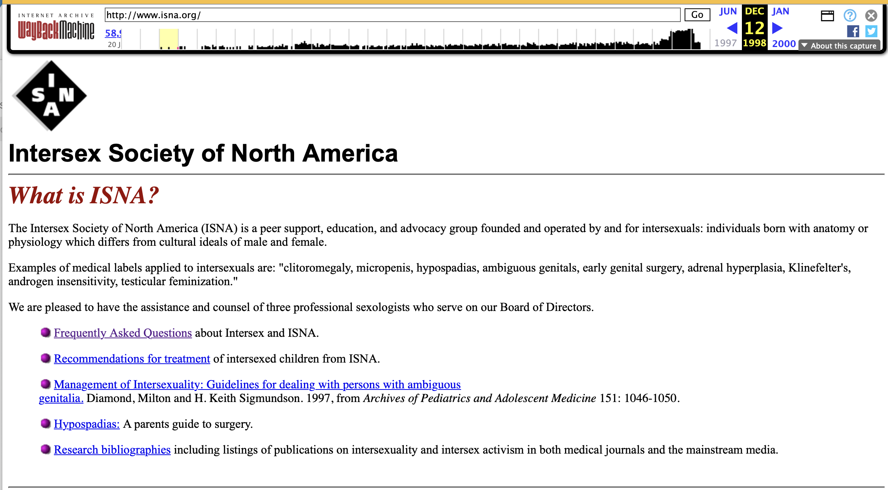

## Headnote

I registered `isna.org` on 31 October 1994 — a year after ISNA was announced 
in a letter published in *The Sciences*. The domain has outlived the organization itself: ISNA
closed in 2008, and the site is now preserved as a historical archive by
interACT. The newsletter reached the people who already knew to look for us. The website
was how the people who *didn't* found us. I recall that I hurried to register
a domain name and set up a basic website just before some bit of media 
that refused to publish our mailing address went to print.

No capture of the earliest version of the site survives. The oldest one the
Internet Archive holds dates to **12 December 1998**, four years after the domain
was registered — a reminder that the open web forgets quickly, and that what we
have is the earliest *surviving* trace, not the first page we put up.

## The evidence

**Domain registration.** The `isna.org` domain was registered on
**1994-10-31** (31 October 1994, 05:00:00 UTC), per the domain registry's
record (`Registered On: 1994-10-31T05:00:00.691Z`).

**Earliest known capture.** The earliest snapshot of the site held by the
Internet Archive's Wayback Machine was captured on **1998-12-12** (12 December
1998, 03:00:50 UTC):

> <https://web.archive.org/web/19981212030050/http://www.isna.org/>

[{#fig-wayback fig-alt="Screenshot of the isna.org home page as captured by the Wayback Machine on 12 December 1998"}](https://web.archive.org/web/19981212030050/http://www.isna.org/){target="_blank"}

---

## Source & citation

This page is generated to mirror the catalog record, so the two never drift.

| Field        | Value |
|--------------|-------|
| Catalog id   | `isna-org-website` |
| Date         | 1994-10-31 (domain registration); earliest capture 1998-12-12 |
| Medium       | Website / web capture |
| Source       | Internet Archive Wayback Machine capture `19981212030050`; domain registry record |
| Held at      | Live capture at the Internet Archive; site preserved by interACT |
| Rights       | ISNA's own website — full rights. WHOIS date and Wayback capture are public records. |
| Status       | Cleared|

**Suggested citation.** Cheryl Chase, *isna.org: the movement moves online*.
The Bo Laurent Papers, catalog `isna-org-website`. Earliest capture:
Internet Archive Wayback Machine,
<https://web.archive.org/web/19981212030050/http://www.isna.org/>,
captured 12 December 1998. Domain registered 31 October 1994.
