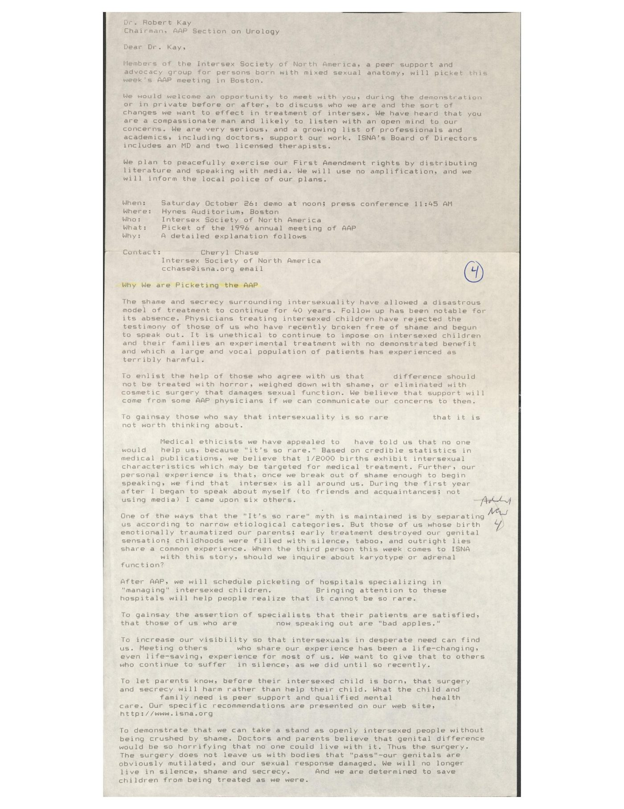

In October 1996, writing under the name Cheryl Chase, Bo Laurent sent this letter to Dr. Robert Kay, chair of the American Academy of Pediatrics' Section on Urology, in the days before the Intersex Society of North America picketed the Academy's annual meeting at the Hynes in Boston. The letter invited Kay to meet with ISNA members and announced the demonstration set for Saturday, 26 October. Appended to it is the statement handed out at the picket, "Why We Are Picketing the AAP," which set out the reasons for the action. The demonstration was the first public protest by intersex people in the United States, and its anniversary is now observed as Intersex Awareness Day.

{.lightbox width="360" fig-alt="A typewritten, monospaced page: a letter addressed to Dr. Robert Kay, Chairman of the AAP Section on Urology, followed by a statement headed Why We are Picketing the AAP."}

## Transcription

Dr. Robert Kay[^kay]
Chairman, AAP Section on Urology

Dear Dr. Kay,

Members of the Intersex Society of North America, a peer support and advocacy group for persons born with mixed sexual anatomy, will picket this week's AAP meeting in Boston[^demo].

We would welcome an opportunity to meet with you, during the demonstration or in private before or after, to discuss who we are and the sort of changes we want to effect in treatment of intersex. We have heard that you are a compassionate man and likely to listen with an open mind to our concerns. We are very serious, and a growing list of professionals and academics, including doctors, support our work. ISNA's Board of Directors includes an MD and two licensed therapists.

We plan to peacefully exercise our First Amendment rights by distributing literature and speaking with media. We will use no amplification, and we will inform the local police of our plans.

```
When:    Saturday October 26: demo at noon; press conference 11:45 AM
Where:   Hynes Auditorium, Boston
Who:     Intersex Society of North America
What:    Picket of the 1996 annual meeting of AAP
Why:     A detailed explanation follows
```

```
Contact:      Cheryl Chase
              Intersex Society of North America
              cchase@isna.org email
```

**Why We are Picketing the AAP**

The shame and secrecy surrounding intersexuality have allowed a disastrous model of treatment to continue for 40 years. Follow up has been notable for its absence. Physicians treating intersexed children have rejected the testimony of those of us who have recently broken free of shame and begun to speak out. It is unethical to continue to impose on intersexed children and their families an experimental treatment with no demonstrated benefit and which a large and vocal population of patients has experienced as terribly harmful.

To enlist the help of those who agree with us that [genital?] difference should not be treated with horror, weighed down with shame, or eliminated with cosmetic surgery that damages sexual function. We believe that support will come from some AAP physicians if we can communicate our concerns to them.

To gainsay those who say that intersexuality is so rare that it is not worth thinking about.

Medical ethicists we have appealed to have told us that no one would help us, because "it's so rare". Based on credible statistics in medical publications, we believe that 1/2000 births[^prevalence] exhibit intersexual characteristics which may be targeted for medical treatment. Further, our personal experience is that, once we break out of shame enough to begin speaking, we find that intersex is all around us. During the first year after I began to speak about myself (to friends and acquaintances; not using media) I came upon six others.

One of the ways that the "It's so rare" myth is maintained is by separating us according to narrow etiological categories. But those of us whose birth emotionally traumatized our parents; early treatment destroyed our genital sensation; childhoods were filled with silence, taboo, and outright lies share a common experience. When the third person this week comes to ISNA with this story, should we inquire about karyotype or adrenal function?

After AAP, we will schedule picketing of hospitals specializing in "managing" intersexed children. Bringing attention to these hospitals will help people realize that it cannot be so rare.

To gainsay the assertion of specialists that their patients are satisfied, that those of us who are now speaking out are "bad apples."

To increase our visibility so that intersexuals in desperate need can find us. Meeting others who share our experience has been a life-changing, even life-saving, experience for most of us. We want to give that to others who continue to suffer in silence, as we did until so recently.

To let parents know, before their intersexed child is born, that surgery and secrecy will harm rather than help their child. What the child and family need is peer support and qualified mental health care. Our specific recommendations are presented on our web site, http://www.isna.org

To demonstrate that we can take a stand as openly intersexed people without being crushed by shame. Doctors and parents believe that genital difference would be so horrifying that no one could live with it. Thus the surgery. The surgery does not leave us with bodies that "pass"--our genitals are obviously mutilated, and our sexual response damaged. We will no longer live in silence, shame and secrecy. And we are determined to save children from being treated as we were.

## Textual notes

The original is a typewritten (monospaced) document reproduced as a photographic scan. Wide inter-word gaps in the original are artifacts of full justification and have been normalized to single spaces; they do not mark missing text.

`[genital?]` in the second paragraph of the statement is a conjectural reading. A word appears to have dropped out of the phrase "agree with us that ___ difference should not be treated with horror," and no text is legible in the gap. *genital* is a guess, consistent with the statement's later "genital difference would be so horrifying"; it is not legible in the source and should not be treated as established.

Two manuscript annotations on the scan are not part of the typed text: a circled "4" in the right margin beside the contact block, and a pencilled "Add'l NEW 4" in the right margin beside the paragraph beginning "Medical ethicists we have appealed to." Both appear to be later filing or enumeration marks.

## Further reading

The picket and the debate it opened were followed in the surgical trade press. See [Press coverage in *Urology Times*, 1997–1998](/archive/scheck-urology-times-1997-1998/) — three articles by Anne Scheck, written between February 1997 and February 1998, in which Cheryl Chase and ISNA are quoted.

## Source

An access copy: a single-page scan held in the Suzanne Kessler Papers at the University of Michigan's Labadie Collection, burst from the larger Kessler correspondence scan set. See the source sidecar for fixity and a note on the item's placement within that collection.

## Citation

| Field | Value |
|---|---|
| Item | `letter-kay-1996` |
| Subject | Letter to Dr. Robert Kay, with "Why We Are Picketing the AAP" |
| Date | 1996-10 (undated; just prior to 1996-10-26) |
| From | Bo Laurent (as Cheryl Chase), Intersex Society of North America |
| To | Dr. Robert Kay, Chairman, AAP Section on Urology |
| Rights | Public advocacy leaflet authored by Bo Laurent (as Cheryl Chase); distributed at the 1996 AAP demonstration. |
| Status | cleared; published |
| Source | `sources/documents/aap-picket-1996/Why_we_are_picketing_the_AAP_1996.pdf` |

<!-- identifications: click-through footnotes -->

[^kay]: Identified here as chair of the American Academy of Pediatrics' Section on Urology in 1996. The Section, founded in 1971, is the AAP body for pediatric urologic disease; its members included the surgeons performing the infant genital surgeries the demonstration opposed. Kay is addressed in that official capacity.

[^prevalence]: The prevalence estimate ISNA circulated: roughly one in two thousand births with genitals atypical enough to prompt medical or surgical intervention. The figure became a defining movement statistic and was later associated with Anne Fausto-Sterling's work; estimates in this area vary widely with how intersex is defined and remain contested.

[^demo]: The picket announced here was held Saturday, 26 October 1996 outside the AAP annual meeting at the Hynes Convention Center in Boston. It was the first public demonstration by intersex people in the United States, staged under the banner "Hermaphrodites with Attitude" with allies from the group Transsexual Menace; participants included Morgan Holmes and Max Beck. The AAP declined to meet the picketers and released a press statement defending early genital surgery. The anniversary is now observed internationally as Intersex Awareness Day.
