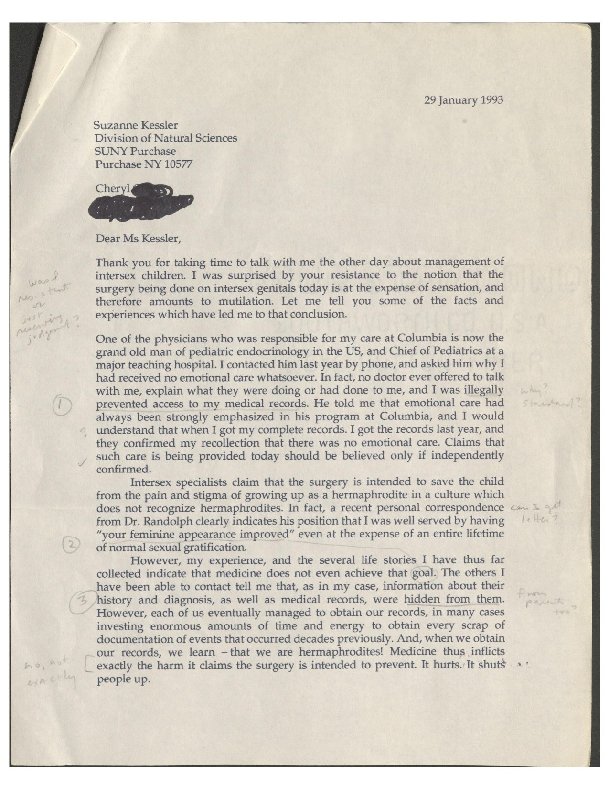
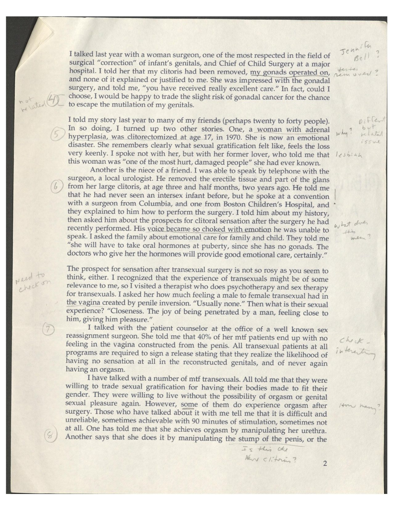
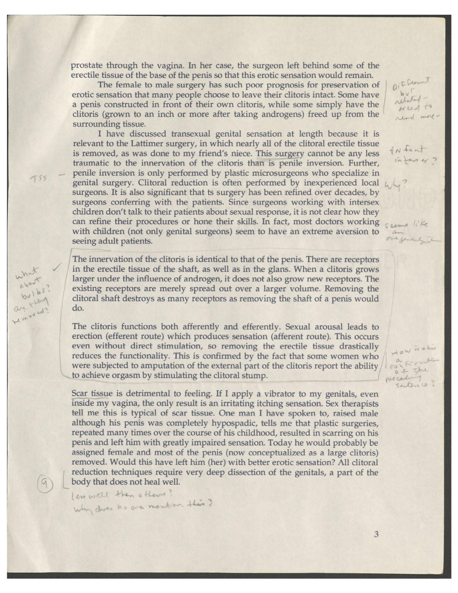
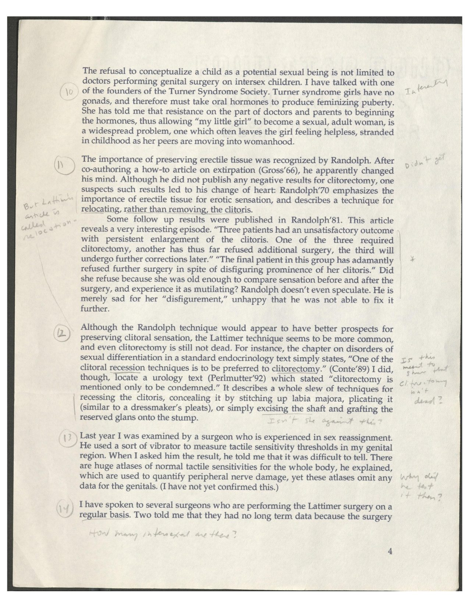
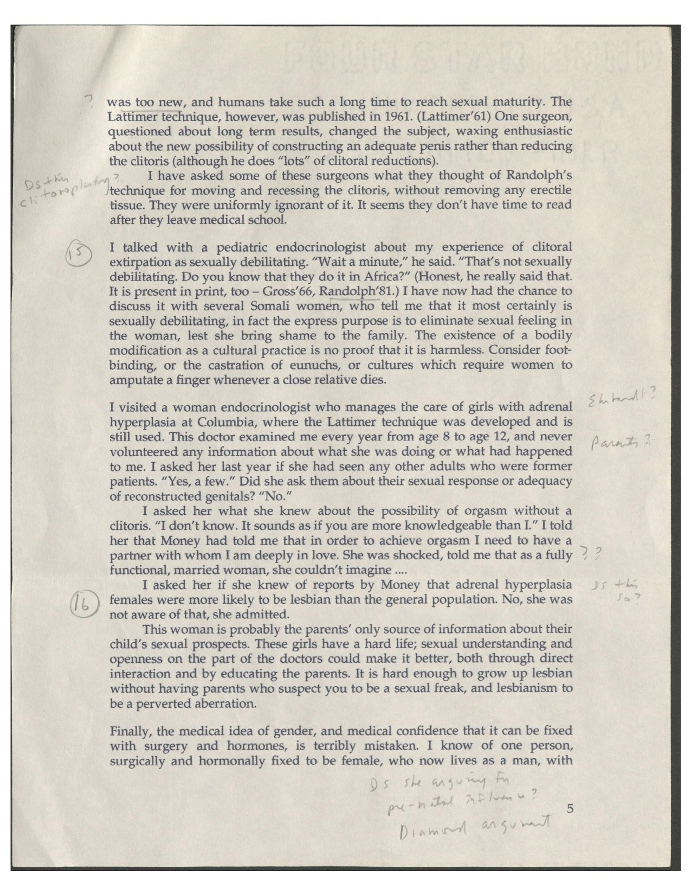
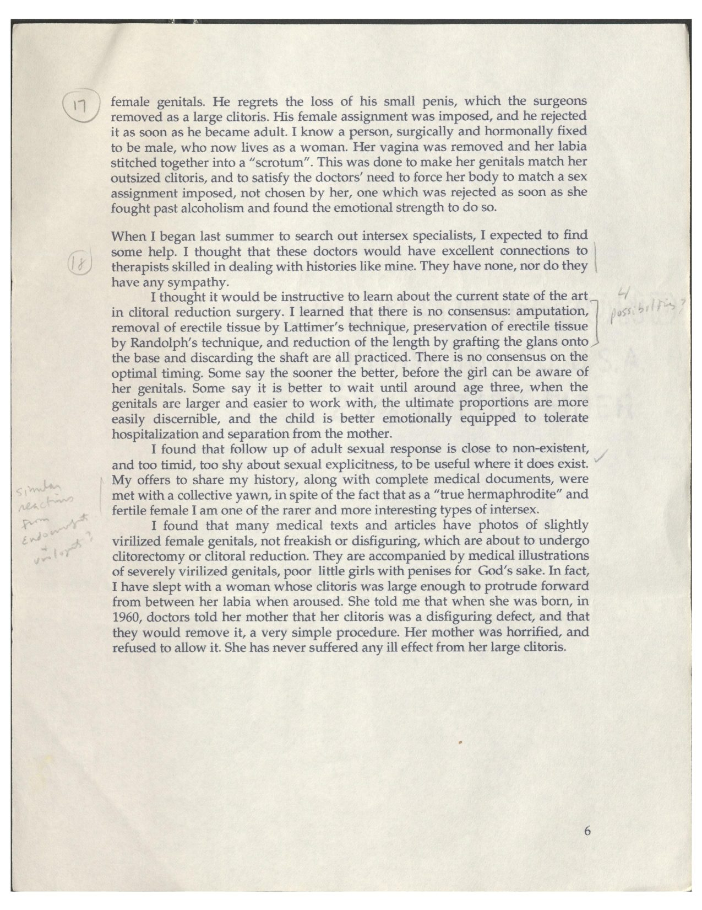
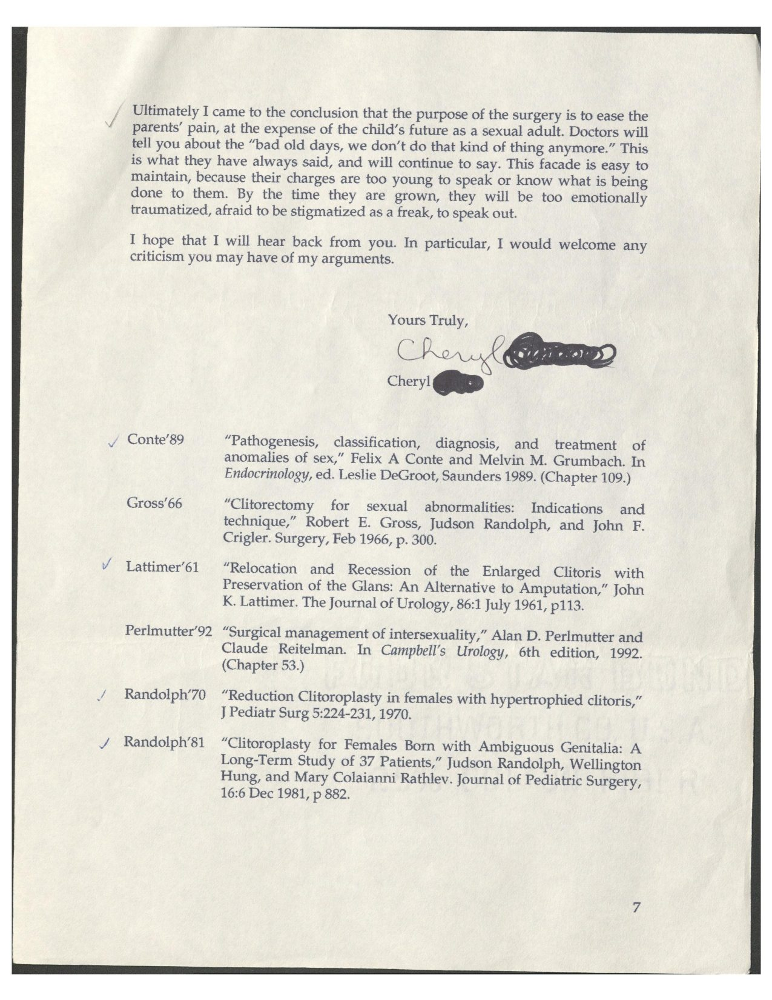

## Headnote

::: {.content-hidden}
> "In re-reading the letter it's so clear that in 1993 you knew so much and I knew
> so little. I spent the next decade playing catch up. Receiving the letter was the
> giant impetus and I remember how excited I was to read what you sent."
>
> — Suzanne Kessler, on receiving this letter, 2026
:::

I wrote this letter to **Suzanne Kessler** on 29 January 1993, just after we had
spoken by phone. Kessler was then a psychologist at SUNY Purchase; her 1990
article "The Medical Construction of Gender" made her one of the few scholars taking the medical management
of intersex people seriously — which is why I sought her out. She would 
go on to publish  *Lessons from the Intersexed* in 1998.
Our call had left
me stung: she had not accepted, or was not yet ready to accept, the claim at
the center of everything I was arguing — that the surgery done to intersex
children is done *at the expense of sexual sensation*, and therefore amounts to
mutilation. This letter is my attempt to lay the evidence in front of her.

It is one of my earliest pieces of movement correspondence, written in the same
stretch of months as the first contacts with journalists and clinicians, before
there was an organization with a name to speak for any of us. What it shows is
the argument being assembled in real time: my own history at Columbia; the
Randolph and Lattimer and Gross literature I had tracked down; the testimony I
was collecting from other intersex people, from trans women, from the surgeons
themselves. I marshalled all of it toward a single point — that clitoral surgery
is not the cosmetic tidying its practitioners describe, but the destruction of
erectile tissue and its nerves.

What makes this particular copy unusual is that Kessler read it with a pen in her
hand. Her questions, objections, and cross-references are written in the margins
of nearly every page — *"Was she resistant or just reserving judgment?"*,
*"How many intersexual are there?"*, *"Is she arguing for pre-natal influence?"*
The page is therefore not a monologue but a record of a scholar arguing back.
Our correspondence continued in depth, with eight letters in 1993-1994.
I have preserved her marginalia as a second layer below the letter.

::: {.callout-note collapse="true"}
## A note on provenance and this transcription
This is a scanned physical letter held in the Suzanne Kessler papers at the
Labadie Collection, University of Michigan. The transcription preserves
original spelling and the author's non-standard forms (*"transexual"*,
*"clitorectomy"*); `[sic]` marks genuine irregularities left intact, and square
brackets mark editorial clarifications. The signature surname is blacked out in
the source scan and is left redacted here. See the source note at the foot of the
page for fixity data and the full list of items the review pass must resolve.
:::

## The annotated original

The letter as Suzanne Kessler read it — seven pages carrying her handwritten
responses in the margins. Click any page to open it full size; the complete
scan is also available as a [downloadable PDF](kessler-1993-01-29.pdf) (7 pp.).
A transcription follows below, and Kessler's annotations are transcribed as a
[separate layer](#annotations).

::: {layout-ncol=2}

:::

## The letter

> **29 January 1993**
>
> Suzanne Kessler\
> Division of Natural Sciences\
> SUNY Purchase\
> Purchase NY 10577
>
> Dear Ms Kessler,

Thank you for taking time to talk with me the other day about management of
intersex children. I was surprised by your resistance to the notion that the
surgery being done on intersex genitals today is at the expense of sensation, and
therefore amounts to mutilation. Let me tell you some of the facts and experiences
which have led me to that conclusion. [^m1]

One of the physicians who was responsible for my care at Columbia is now the grand
old man of pediatric endocrinology in the US, and Chief of Pediatrics at a major
teaching hospital. I contacted him last year by phone, and asked him why I had
received no emotional care whatsoever. In fact, no doctor ever offered to talk with
me, explain what they were doing or had done to me, and I was illegally prevented
access to my medical records.[^m2] He told me that emotional care had always been
strongly emphasized in his program at Columbia, and I would understand that when I
got my complete records. I got the records last year, and they confirmed my
recollection that there was no emotional care. Claims that such care is being
provided today should be believed only if independently confirmed.

Intersex specialists claim that the surgery is intended to save the child from the
pain and stigma of growing up as a hermaphrodite in a culture which does not
recognize hermaphrodites. In fact, a recent personal correspondence from Dr.
Randolph clearly indicates his position that I was well served by having "your
feminine appearance improved" even at the expense of an entire lifetime of normal
sexual gratification.[^m3]

However, my experience, and the several life stories I have thus far collected
indicate that medicine does not even achieve that goal. The others I have been able
to contact tell me that, as in my case, information about their history and
diagnosis, as well as medical records, were hidden from them. However, each of us
eventually managed to obtain our records, in many cases investing enormous amounts
of time and energy to obtain every scrap of documentation of events that occurred
decades previously. And, when we obtain our records, we learn -- that we are
hermaphrodites! Medicine thus inflicts exactly the harm it claims the surgery is
intended to prevent. It hurts. It shuts people up.[^m4]

I talked last year with a woman surgeon, one of the most respected in the field of
surgical "correction" of infant's genitals, and Chief of Child Surgery at a major
hospital. I told her that my clitoris had been removed, my gonads operated on, and
none of it explained or justified to me. She was impressed with the gonadal
surgery, and told me, "you have received really excellent care." In fact, could I
choose, I would be happy to trade the slight risk of gonadal cancer for the chance
to escape the mutilation of my genitals.[^m5]

I told my story last year to many of my friends (perhaps twenty to forty people).
In so doing, I turned up two other stories. One, a woman with adrenal hyperplasia,
was clitorectomized at age 17, in 1970. She is now an emotional disaster. She
remembers clearly what sexual gratification felt like, feels the loss very keenly.
I spoke not with her, but with her former lover, who told me that this woman was
"one of the most hurt, damaged people" she had ever known.[^m6]

Another is the niece of a friend. I was able to speak by telephone with the
surgeon, a local urologist. He removed the erectile tissue and part of the glans
from her large clitoris, at age three and half months, two years ago. He told me
that he had never seen an intersex infant before, but he spoke at a convention with
a surgeon from Columbia, and one from Boston Children's Hospital, and they explained
to him how to perform the surgery. I told him about my history, then asked him about
the prospects for clitoral sensation after the surgery he had recently performed.
His voice became so choked with emotion he was unable to speak. I asked the family
about emotional care for family and child. They told me "she will have to take oral
hormones at puberty, since she has no gonads. The doctors who give her the hormones
will provide good emotional care, certainly."[^m7]

The prospect for sensation after transexual surgery is not so rosy as you seem to
think, either. I recognized that the experience of transexuals might be of some
relevance to me, so I visited a therapist who does psychotherapy and sex therapy for
transexuals. I asked her how much feeling a male to female transexual had in the
vagina created by penile inversion. "Usually none." Then what is their sexual
experience? "Closeness. The joy of being penetrated by a man, feeling close to him,
giving him pleasure."[^m8]

I talked with the patient counselor at the office of a well known sex reassignment
surgeon. She told me that 40% of her mtf patients end up with no feeling in the
vagina constructed from the penis. All transexual patients at all programs are
required to sign a release stating that they realize the likelihood of having no
sensation at all in the reconstructed genitals, and of never again having an
orgasm.[^m9]

I have talked with a number of mtf transexuals. All told me that they were willing
to trade sexual gratification for having their bodies made to fit their gender. They
were willing to live without the possibility of orgasm or genital sexual pleasure
again. However, some of them do experience orgasm after surgery.[^m10] Those who
have talked about it with me tell me that it is difficult and unreliable, sometimes
achievable with 90 minutes of stimulation, sometimes not at all. One has told me
that she achieves orgasm by manipulating her urethra. Another says that she does it
by manipulating the stump of the penis, or the prostate through the vagina.[^m11] In
her case, the surgeon left behind some of the erectile tissue of the base of the
penis so that this erotic sensation would remain.

The female to male surgery has such poor prognosis for preservation of erotic
sensation that many people choose to leave their clitoris intact. Some have a penis
constructed in front of their own clitoris, while some simply have the clitoris
(grown to an inch or more after taking androgens) freed up from the surrounding
tissue.[^m12]

I have discussed transexual genital sensation at length because it is relevant to the
Lattimer surgery, in which nearly all of the clitoral erectile tissue is removed, as
was done to my friend's niece. This surgery cannot be any less traumatic to the
innervation of the clitoris than is penile inversion.[^m13] Further, penile inversion
is only performed by plastic microsurgeons who specialize in genital surgery.
Clitoral reduction is often performed by inexperienced local surgeons. It is also
significant that ts surgery has been refined over decades, by surgeons conferring with
the patients. Since surgeons working with intersex children don't talk to their
patients about sexual response, it is not clear how they can refine their procedures
or hone their skills. In fact, most doctors working with children (not only genital
surgeons) seem to have an extreme aversion to seeing adult patients.[^m14]

The innervation of the clitoris is identical to that of the penis. There are receptors
in the erectile tissue of the shaft, as well as in the glans. When a clitoris grows
larger under the influence of androgen, it does not also grow new receptors. The
existing receptors are merely spread out over a larger volume. Removing the clitoral
shaft destroys as many receptors as removing the shaft of a penis would do.[^m15]

The clitoris functions both afferently and efferently. Sexual arousal leads to
erection (efferent route) which produces sensation (afferent route). This occurs even
without direct stimulation, so removing the erectile tissue drastically reduces the
functionality. This is confirmed by the fact that some women who were subjected to
amputation of the external part of the clitoris report the ability to achieve orgasm
by stimulating the clitoral stump.[^m16]

Scar tissue is detrimental to feeling. If I apply a vibrator to my genitals, even
inside my vagina, the only result is an irritating itching sensation. Sex therapists
tell me this is typical of scar tissue. One man I have spoken to, raised male although
his penis was completely hypospadic, tells me that plastic surgeries, repeated many
times over the course of his childhood, resulted in scarring on his penis and left him
with greatly impaired sensation. Today he would probably be assigned female and most
of the penis (now conceptualized as a large clitoris) removed. Would this have left
him (her) with better erotic sensation? All clitoral reduction techniques require very
deep dissection of the genitals, a part of the body that does not heal well.[^m17]

The refusal to conceptualize a child as a potential sexual being is not limited to
doctors performing genital surgery on intersex children. I have talked with one of the
founders of the Turner Syndrome Society. Turner syndrome girls have no gonads, and
therefore must take oral hormones to produce feminizing puberty. She has told me that
resistance on the part of doctors and parents to beginning the hormones, thus allowing
"my little girl" to become a sexual, adult woman, is a widespread problem, one which
often leaves the girl feeling helpless, stranded in childhood as her peers are moving
into womanhood.[^m18]

The importance of preserving erectile tissue was recognized by Randolph. After
co-authoring a how-to article on extirpation (Gross'66), he apparently changed his
mind. Although he did not publish any negative results for clitorectomy, one suspects
such results led to his change of heart: Randolph'70 emphasizes the importance of
erectile tissue for erotic sensation, and describes a technique for relocating, rather
than removing, the clitoris.[^m19]

Some follow up results were published in Randolph'81. This article reveals a very
interesting episode. "Three patients had an unsatisfactory outcome with persistent
enlargement of the clitoris. One of the three required clitorectomy, another has thus
far refused additional surgery, the third will undergo further corrections later." "The
final patient in this group has adamantly refused further surgery in spite of
disfiguring prominence of her clitoris." Did she refuse because she was old enough to
compare sensation before and after the surgery, and experience it as mutilating?
Randolph doesn't even speculate. He is merely sad for her "disfigurement," unhappy that
he was not able to fix it further.[^m20]

Although the Randolph technique would appear to have better prospects for preserving
clitoral sensation, the Lattimer technique seems to be more common, and even
clitorectomy is still not dead. For instance, the chapter on disorders of sexual
differentiation in a standard endocrinology text simply states, "One of the clitoral
recession techniques is to be preferred to clitorectomy." (Conte'89) I did, though,
locate a urology text (Perlmutter'92) which stated "clitorectomy is mentioned only to
be condemned." It describes a whole slew of techniques for recessing the clitoris,
concealing it by stitching up labia majora, plicating it (similar to a dressmaker's
pleats), or simply excising the shaft and grafting the reserved glans onto the
stump.[^m21]

Last year I was examined by a surgeon who is experienced in sex reassignment. He used
a sort of vibrator to measure tactile sensitivity thresholds in my genital region.
When I asked him the result, he told me that it was difficult to tell. There are huge
atlases of normal tactile sensitivities for the whole body, he explained, which are
used to quantify peripheral nerve damage, yet these atlases omit any data for the
genitals. (I have not yet confirmed this.)[^m22]

I have spoken to several surgeons who are performing the Lattimer surgery on a regular
basis. Two told me that they had no long term data because the surgery was too new, and
humans take such a long time to reach sexual maturity. The Lattimer technique, however,
was published in 1961. (Lattimer'61) One surgeon, questioned about long term results,
changed the subject, waxing enthusiastic about the new possibility of constructing an
adequate penis rather than reducing the clitoris (although he does "lots" of clitoral
reductions).[^m23]

I have asked some of these surgeons what they thought of Randolph's technique for
moving and recessing the clitoris, without removing any erectile tissue. They were
uniformly ignorant of it. It seems they don't have time to read after they leave
medical school.

I talked with a pediatric endocrinologist about my experience of clitoral extirpation
as sexually debilitating. "Wait a minute," he said. "That's not sexually debilitating.
Do you know that they do it in Africa?" (Honest, he really said that. It is present in
print, too -- Gross'66, Randolph'81.) I have now had the chance to discuss it with
several Somali women, who tell me that it most certainly is sexually debilitating, in
fact the express purpose is to eliminate sexual feeling in the woman, lest she bring
shame to the family. The existence of a bodily modification as a cultural practice is
no proof that it is harmless. Consider foot-binding, or the castration of eunuchs, or
cultures which require women to amputate a finger whenever a close relative dies.[^m24]

I visited a woman endocrinologist who manages the care of girls with adrenal
hyperplasia at Columbia, where the Lattimer technique was developed and is still used.
This doctor examined me every year from age 8 to age 12, and never volunteered any
information about what she was doing or what had happened to me. I asked her last year
if she had seen any other adults who were former patients. "Yes, a few." Did she ask
them about their sexual response or adequacy of reconstructed genitals? "No."[^m25]

I asked her what she knew about the possibility of orgasm without a clitoris. "I don't
know. It sounds as if you are more knowledgeable than I." I told her that Money had told
me that in order to achieve orgasm I need to have a partner with whom I am deeply in
love. She was shocked, told me that as a fully functional, married woman, she couldn't
imagine ....[^m26]

I asked her if she knew of reports by Money that adrenal hyperplasia females were more
likely to be lesbian than the general population. No, she was not aware of that, she
admitted.[^m27]

This woman is probably the parents' only source of information about their child's
sexual prospects. These girls have a hard life; sexual understanding and openness on
the part of the doctors could make it better, both through direct interaction and by
educating the parents. It is hard enough to grow up lesbian without having parents who
suspect you to be a sexual freak, and lesbianism to be a perverted aberration.

Finally, the medical idea of gender, and medical confidence that it can be fixed with
surgery and hormones, is terribly mistaken. I know of one person, surgically and
hormonally fixed to be female, who now lives as a man, with female genitals. He regrets
the loss of his small penis, which the surgeons removed as a large clitoris. His female
assignment was imposed, and he rejected it as soon as he became adult. I know a person,
surgically and hormonally fixed to be male, who now lives as a woman. Her vagina was
removed and her labia stitched together into a "scrotum". This was done to make her
genitals match her outsized clitoris, and to satisfy the doctors' need to force her
body to match a sex assignment imposed, not chosen by her, one which was rejected as
soon as she fought past alcoholism and found the emotional strength to do so.[^m28]

When I began last summer to search out intersex specialists, I expected to find some
help. I thought that these doctors would have excellent connections to therapists
skilled in dealing with histories like mine. They have none, nor do they have any
sympathy.[^m29]

I thought it would be instructive to learn about the current state of the art in
clitoral reduction surgery. I learned that there is no consensus: amputation, removal
of erectile tissue by Lattimer's technique, preservation of erectile tissue by
Randolph's technique, and reduction of the length by grafting the glans onto the base
and discarding the shaft are all practiced.[^m30] There is no consensus on the optimal
timing. Some say the sooner the better, before the girl can be aware of her genitals.
Some say it is better to wait until around age three, when the genitals are larger and
easier to work with, the ultimate proportions are more easily discernible, and the
child is better emotionally equipped to tolerate hospitalization and separation from the
mother.

I found that follow up of adult sexual response is close to non-existent, and too timid,
too shy about sexual explicitness, to be useful where it does exist. My offers to share
my history, along with complete medical documents, were met with a collective yawn, in
spite of the fact that as a "true hermaphrodite" and fertile female I am one of the
rarer and more interesting types of intersex.[^m31]

I found that many medical texts and articles have photos of slightly virilized female
genitals, not freakish or disfiguring, which are about to undergo clitorectomy or
clitoral reduction. They are accompanied by medical illustrations of severely virilized
genitals, poor little girls with penises for God's sake. In fact, I have slept with a
woman whose clitoris was large enough to protrude forward from between her labia when
aroused. She told me that when she was born, in 1960, doctors told her mother that her
clitoris was a disfiguring defect, and that they would remove it, a very simple
procedure. Her mother was horrified, and refused to allow it. She has never suffered any
ill effect from her large clitoris.

Ultimately I came to the conclusion that the purpose of the surgery is to ease the
parents' pain, at the expense of the child's future as a sexual adult. Doctors will tell
you about the "bad old days, we don't do that kind of thing anymore." This is what they
have always said, and will continue to say. This facade is easy to maintain, because
their charges are too young to speak or know what is being done to them. By the time they
are grown, they will be too emotionally traumatized, afraid to be stigmatized as a freak,
to speak out.[^m32]

I hope that I will hear back from you. In particular, I would welcome any criticism you
may have of my arguments.

> Yours Truly,\
> Cheryl [surname redacted in source]

### References cited in the letter

| Key | Reference |
|-----|-----------|
| Conte'89 | "Pathogenesis, classification, diagnosis, and treatment of anomalies of sex," Felix A. Conte and Melvin M. Grumbach. In *Endocrinology*, ed. Leslie DeGroot, Saunders 1989. (Chapter 109.) |
| Gross'66 | "Clitorectomy for sexual abnormalities: Indications and technique," Robert E. Gross, Judson Randolph, and John F. Crigler. *Surgery*, Feb 1966, p. 300. |
| Lattimer'61 | "Relocation and Recession of the Enlarged Clitoris with Preservation of the Glans: An Alternative to Amputation," John K. Lattimer. *The Journal of Urology*, 86:1, July 1961, p. 113. |
| Perlmutter'92 | "Surgical management of intersexuality," Alan D. Perlmutter and Claude Reitelman. In *Campbell's Urology*, 6th ed., 1992. (Chapter 53.) |
| Randolph'70 | "Reduction Clitoroplasty in females with hypertrophied clitoris," J Pediatr Surg 5:224–231, 1970. |
| Randolph'81 | "Clitoroplasty for Females Born with Ambiguous Genitalia: A Long-Term Study of 37 Patients," Judson Randolph, Wellington Hung, and Mary Colaianni Rathlev. *Journal of Pediatric Surgery*, 16:6, Dec 1981, p. 882. |

## Recipient's annotations {#annotations}

Suzanne Kessler read this copy with a pen in hand and left comments in the margins.
They are transcribed here as a second layer, keyed by superscript to the point in the
letter they sit beside. She numbered many of her notes **(1)–(18)** in the left margin;
those numbers are given in brackets where present. Readings marked **[?]** are
uncertain from the scan and need a second look against the original.

[^m1]: *"Was she resistant or just reserving judgment?"* — beside the opening sentence.
[^m2]: *"why? standard?"* — beside "illegally prevented access to my medical records." **[Kessler note (1)]** beside this paragraph.
[^m3]: *"can I get letter?"* — beside the reference to Dr. Randolph's personal correspondence. **[note (2)]**
[^m4]: *"from parents too?"* — beside "were hidden from them." **[note (3)]** And, bracketing the last three sentences: *"no, not exactly."*
[^m5]: *"Jennifer Bell?"* **[?]** and *"testes removed?"* — beside the woman surgeon. **[note (4)]** *"not related"* — beside the gonadal-cancer trade.
[^m6]: **[note (5)]** *"why? Different but related issue"* and *"lesbian"* — beside the woman with adrenal hyperplasia.
[^m7]: **[note (6)]** *"what does this mean?"* — beside "good emotional care, certainly."
[^m8]: *"Need to check on"* — beside this paragraph.
[^m9]: **[note (7)]** *"check — interesting"* — beside the 40% figure.
[^m10]: **[note (8)]** *"how many?"* — beside "some of them do experience orgasm."
[^m11]: *"Is this the new clitoris?"* — beside "manipulating the stump of the penis."
[^m12]: *"Different but related — need to read more"* — beside the female-to-male paragraph.
[^m13]: *"infant intersex?"* / *"why?"* — beside the Lattimer surgery. *"TSS"* in the left margin.
[^m14]: *"seems like an overgeneralization"* — beside "extreme aversion to seeing adult patients."
[^m15]: *"what about bulbs? are they removed?"* — beside the innervation paragraph.
[^m16]: *"How is this a confirmation of the preceding sentence?"* — beside the afferent/efferent paragraph.
[^m17]: **[note (9)]** *"Less well than others? why does no one mention this?"* — beside the scar-tissue paragraph.
[^m18]: **[note (10)]** *"Interesting"* — beside the Turner Syndrome Society paragraph.
[^m19]: **[note (11)]** *"Didn't get"* — beside Randolph's change of mind. *"But Lattimer's article is called relocation."* in the left margin.
[^m20]: *"*"* (asterisk) — beside the Randolph'81 quotations.
[^m21]: **[note (12)]** *"Is this meant to show that clitorectomy isn't dead?"* — beside the Conte'89 / Perlmutter'92 discussion. *"Isn't she against this?"* — beside "excising the shaft and grafting the reserved glans."
[^m22]: **[note (13)]** *"Why did he test it then?"* — beside the tactile-sensitivity examination.
[^m23]: **[note (14)]** beside this paragraph. *"How many intersexual are there?"* at the foot of the page.
[^m24]: *"Distinguish clitoroplasty?"* — in the left margin beside the Randolph-technique paragraph above. **[note (15)]** beside the "Africa" exchange.
[^m25]: *"Ehrhardt?"* **[?]** / *"Parents?"* — beside the woman endocrinologist at Columbia.
[^m26]: *"??"* — beside "a partner with whom I am deeply in love."
[^m27]: *"Is this so?"* — beside the report that adrenal-hyperplasia females were more likely to be lesbian. **[note (16)]** beside this paragraph.
[^m28]: *"Is she arguing for pre-natal influence? Diamond argument"* **[?]** — at the foot of the page. **[note (17)]** beside the person who now lives as a man.
[^m29]: **[note (18)]** beside this paragraph.
[^m30]: *"4 possibilities?"* — beside the list of practiced techniques.
[^m31]: *"similar reactions from Endocrinologist + urologist?"* **[?]** — beside "met with a collective yawn."
[^m32]: A checkmark beside this concluding paragraph; checkmarks also appear beside the Conte'89, Lattimer'61, Randolph'70, and Randolph'81 entries in the reference list.

## Source and provenance {#source}

- **Item ID:** `letter-kessler`
- **Date:** 29 January 1993
- **From:** Bo Laurent (signed *Cheryl*, surname redacted in the source scan), Intersex Society of North America
- **To:** Suzanne Kessler, Division of Natural Sciences, SUNY Purchase, Purchase NY 10577
- **Medium:** Typed letter, physical original, 7 pp., with the recipient's handwritten marginalia
- **Source file:** `sources/letters/kessler/kessler-1993-01-29.pdf`
- **SHA-256:** `08d4763932574d141b1cf4bfed3f6177e1b8c5f41a834946591e216c48fc0606`
- **Held at:**  Suzanne Kessler papers in the Labadie Collection at the University of Michigan
- **Consent:** Suzanne Kessler, 1 July 2026 — publish with her notes. `sources/letters/kessler/consent-kessler-2026-07-01.eml`
- **Related item:** born-digital source of this letter is item `correspondence-kessler-1993-1994` (Word-for-Mac file, letter 1 of 9)

**Provenance note.** This is the canonical scan Kessler saw and approved. A single
redaction has been made: a handwritten phone number on page 1 (Bo's own, long
disconnected) was removed. The signature surname is blacked out in the image (a
pre-existing feature of the physical copy); the author is identified in full in the
headnote and metadata. The upload's filename carried a stray "1994," but the letter's
dateline, 29 January 1993, is authoritative and is used throughout; the PDF's internal
title ("Chase to Kessler, 29 Jan 1993") is correct. The scan was sent to Bo Laurent
by Yarden Azoulay Katz via email/Dropbox on May 19, 2025.

**Textual note — born-digital variant.** A born-digital copy of this letter survives
in the 1993–1994 correspondence file (`correspondence-kessler-1993-1994`). It is not
identical to this mailed, annotated scan: the digital copy renders Dr. Randolph's name
as "Dr. -" (redacted) where the scan names him, and it omits the sentence about the
adrenal-hyperplasia woman's former lover ("one of the most hurt, damaged people…")
that appears in the scan. The mailed scan thus appears to be the later revision (or the
digital master was redacted afterward) — confirm the direction before treating either
as canonical.


