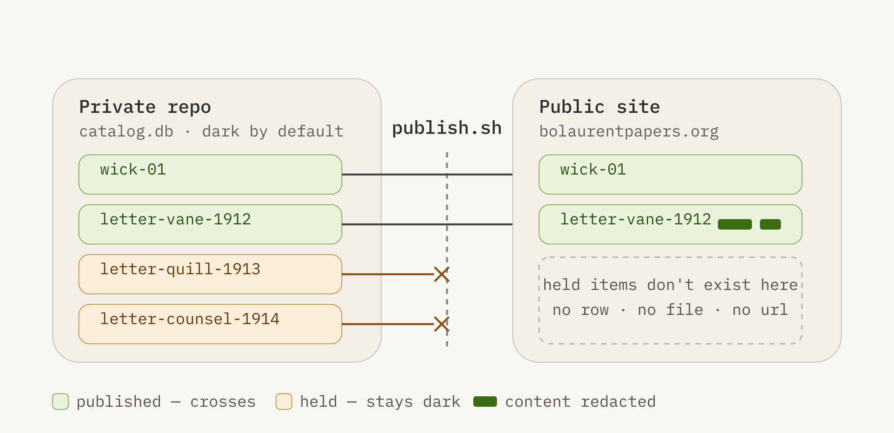

*Working draft*

## Abstract

Metadata-driven static site generators — [CollectionBuilder](https://collectionbuilder.github.io), [Wax](https://minicomp.github.io/wax/), and the broader [Lib-Static](https://lib-static.github.io) and minimal-computing tradition — have made it possible for one person to publish a rigorous digital collection with no server, no database, and no institutional infrastructure. But they share a founding assumption: that everything described in the metadata is destined to be public. For institutional collections of already-cleared objects, that assumption holds. For personal papers, community archives, and oral history — corpora dominated by living third parties, private correspondence, and identifications that cannot be surfaced without review — it fails. In these collections the consent decision is not a preliminary step; it is the central and recurring editorial act.

This article describes a consent firewall built onto a minimal-computing stack for *The Bo Laurent Papers*, an archive of the founding years of the intersex movement. The design makes non-publication the default and enforces it in the data layer rather than through editorial discipline. A relational catalog (SQLite) carries review status, a reviewer's note, and a published flag as first-class fields; a two-repository architecture structurally separates a private working tier from the public site, so a dark item never enters the build at all; and a publish step copies only rows that have been explicitly cleared. Supporting patterns — an intake bench that surfaces the firewall's state at the moment of description, reversible per-identification redaction, and provenance sidecars with fixity — carry the same principle through the workflow. The approach borrows the access-state logic of heavyweight repository frameworks such as [Samvera](https://samvera.org) and [Islandora](https://www.islandora.ca), but keeps it inside a stack that a non-technical steward can inherit, host at no cost, and eventually transfer to an institution intact.

### See Also

* [Digitizing Collections: Digital Collection Platforms: A guide for digitizing collections for access and preservation](https://atla.libguides.com/digitizing-collections/online-content-platforms)
* [Code4Lib](https://code4lib.org)
