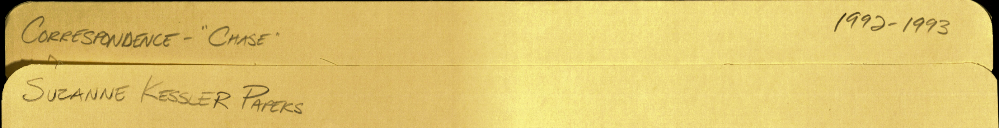

In May 2025 a scholar working with the Suzanne Kessler collection in the Joseph A. Labadie Collection at the University of Michigan Library scanned a folder of letters I wrote in the early 1990s and sent me the copies. I wrote them under the names Bonnie Sullivan and Cheryl Chase, when this work was just beginning. I haven't seen them for decades. 

<!-- *[Bo — this is the beat to write in your own hand: what it was to open the file and read them again. I've left it rather than put words to a reaction that isn't mine to write.]* -->

The letters come from the Suzanne Kessler Papers (ams.0219), Box 1, folder "Correspondence — 'Chase,' 1992–1993," in the [Joseph A. Labadie Collection](https://www.lib.umich.edu/collections/collecting-areas/special-collections/joseph-labadie-collection), Special Collections Research Center, University of Michigan Library. The folder was digitized by the Library in May 2025 at the request of Yarden Azoulay Katz, who sent me the scan on 19 May 2025.

What I hold now is a set of scans. The originals stay at Michigan; these are access copies. The correspondence is under review, and most of it has not gone up here yet. Receiving the scans is not the same as clearing them: a letter joins the collection only after the review it needs, and until then it stays off the public site.

As of now, I have released the following. Note that they *predate* the formation of ISNA. You can see the evolution of my thought, reframing the problem from a personal, medical one to a collective, social justice one.

* [Letter to Suzanne Kessler, 1993](/archive/letter-kessler/index.qmd)
* [Randolph Correspondence, 1992–1993](/archive/correspondence-randolph-1992-1993/index.qmd)

As selected letters are reviewed, the cleared letters will take their place in this published archive. For now they are back in my hands, thirty years on.

